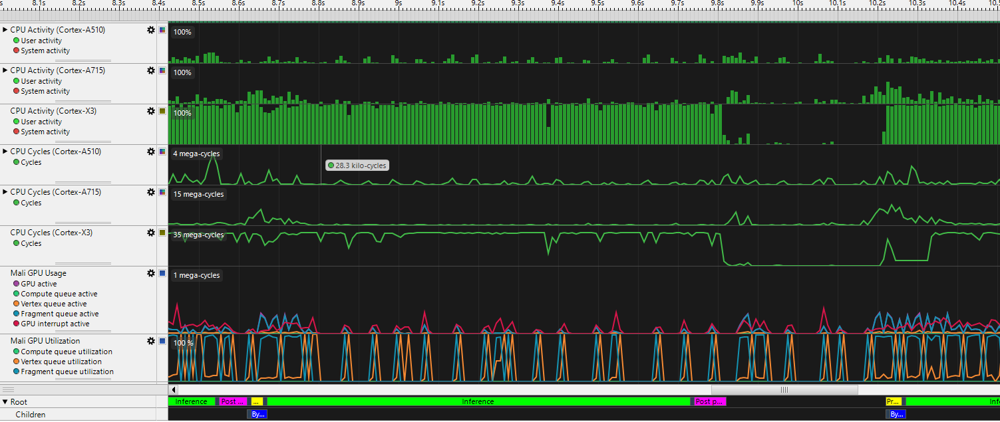
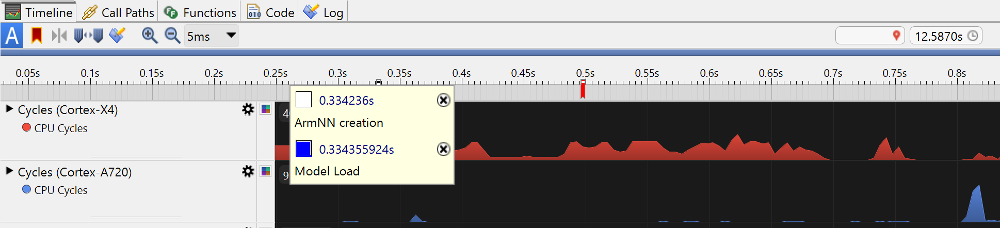

## Application Profiling
Application profiling can be split into 2 main types - *Instrumentation* and *Sampling*. Streamline, for example, is a sampling profiler, that takes regular samples of various counters and registers in the system to provide a detailed view of the system's performance. Sampling will only provide a statistical view, but it is less intrusive and has less processing overhead than instrumentation.

The profiler can look at memory, CPU activity and cycles, cache misses, and many parts of the GPU as well as other performance metrics. It can also provide a timeline view of these counters to show the application's performance over time. This will show bottlenecks, and help you understand where to focus your optimization efforts.



## Streamline
[Streamline](https://developer.arm.com/Tools%20and%20Software/Arm%20Performance%20Studio#Downloads) (and Performance Studio) will be installed on a host machine, and will connect to your target Arm device to capture the data. In our example, this will be an Android phone. The data is captured over a USB connection, and then analyzed on the host machine.

There are many [tutorials and training videos](https://developer.arm.com/Tools%20and%20Software/Arm%20Performance%20Studio) on Streamline, which you can refer to for more depth. Our example will be Android-based, but you can use [these instructions for Linux](https://developer.arm.com/documentation/101816/0903/Getting-started-with-Streamline/Profile-your-Linux-application) setup and capture.

For now, as per these [setup instructions](https://developer.arm.com/documentation/102477/0900/Setup-tasks?lang=en), make sure you have `adb` (Android Debug Bridge) installed. We will be looking at Android Studio profiling shortly, and if you have installed Android Studio, it will have installed adb. Otherwise, you can get it as part of the Android SDK platform tools [here](https://developer.android.com/studio/releases/platform-tools.html).

Make sure adb is in your path. You can check this by running `adb` in a terminal. If it is not in your path, you can add it by adding the `platform-tools` directory to your path. The instructions for this (and location of the directory) will depend on your host machine's operating system.

Next, install [Arm Performance Studio](https://developer.arm.com/Tools%20and%20Software/Arm%20Performance%20Studio#Downloads), which includes Streamline. 

Connect your Android phone to your computer through USB. Ensure that your device is set to [Developer mode](https://developer.android.com/studio/debug/dev-options).

On your device, go to `Settings > Developer Options` and enable USB Debugging. If your device asks you to authorize connection to your computer, confirm this. Test the connection by running `adb devices` in a terminal. You should see your device ID listed.

Next, you need a debuggable build of the application you want to profile. 
- In Android Studio, ensure your *Build Variant* is set to `debug`. You can then build the application and install it on your device. 
- For a Unity app, select Development Build under File > Build Settings when building your application. 
- In Unreal Engine, open Project Settings > Project > Packaging > Project, and ensure that the For Distribution checkbox is not set. 
- In the general case, you can set `android:debuggable=true` in the application manifest file.

You can now run Streamline, and do a capture of your application. This can be used to do a general performance analysis of your application, but we intend to add additional useful information first.

## Custom Annotations

In Streamline it is possible to add custom annotations to the timeline view. This can be useful to mark the start and end of specific parts of your application, or to mark when a specific event occurs. This can help you understand the performance of your application in relation to these events. At the bottom of *Figure 1* above there are custom annotations to show when inference, pre-processing, and post-processing are happening.

To add annotations, we need to add some files into our project from the Gator daemon that Streamline uses. These files are `streamline_annotate.c`, `streamline_annotate.h` and `streamline_annotate_logging.h` from [here](https://github.com/ARM-software/gator/tree/main/annotate). Then we will be able to show log strings, markers, counters and Custom Activity Maps.

These files are obviously C code, so if your Android Studio project is in Java or Kotlin, you will need to add a C library to your project. This is slightly trickier than just adding a Java or Kotlin file, but it is not difficult. You can find instructions on how to do this [here](https://developer.android.com/studio/projects/add-native-code).

For us, we create a file that we will call `annotate_jni_wrapper.c` in the `src/main/cpp/` folder under our project. This will be a wrapper around the Gator daemon's functions, and will be called from our Kotlin code. It starts as below and continues with very similar wrapper functions for the other Gator daemon functions you want.

```c
#include <jni.h>
#include "streamline_annotate.h"

JNIEXPORT void JNICALL Java_AnnotateStreamline_AnnotateSetup(JNIEnv* env, jobject obj) {
    gator_annotate_setup();
}

JNIEXPORT jlong JNICALL Java_AnnotateStreamline_GetTime(JNIEnv* env, jobject obj) {
    return gator_get_time();
}
```

Some functions have `unsigned int`, but that needs to be a `jint` in the wrapper, with some casting required in your Kotlin code to enforce type correctness at that end. Some functions have strings as arguments, and you will need to do a small conversion:

```c
JNIEXPORT void JNICALL Java_AnnotateStreamline_AnnotateMarkerColorStr(JNIEnv* env, jobject obj, jint color, jstring str) {
    const char* nativeStr = (*env)->GetStringUTFChars(env, str, 0);
    gator_annotate_marker_color(color, nativeStr);
    (*env)->ReleaseStringUTFChars(env, str, nativeStr);
}
```

In Android Studio `cmake` is used to create your C library, so we need a CMakelists.txt file in the same directory as the C file. This will look like:

```cmake
# Sets the minimum CMake version required for this project.
cmake_minimum_required(VERSION 3.22.1)

# Declare the project name. 
project("StreamlineAnnotationJNI")

# Create and name the library
add_library(${CMAKE_PROJECT_NAME} SHARED
    annotate_jni_wrapper.c
    streamline_annotate.c)

# Specifies libraries CMake should link to your target library. 
# Adding in the Android system log library pulls in the NDK path.
find_library( # Sets the path to the NDK library.
        log-lib
        log )

target_link_libraries( # Specifies the target library.
        ${CMAKE_PROJECT_NAME}
        ${log-lib} )
```

If you add the following to the `build.gradle` file of the Module you wish to profile, you will be able to call the functions from your Kotlin code:

```gradle
    externalNativeBuild {
        cmake {
            path file('src/main/cpp/CMakeLists.txt')
            version '3.22.1'
        }
    }
```

This will create a `libStreamlineAnnotationJNI.so` library that you can load in your Kotlin code, and then you can call the functions. Here we create a singleton `AnnotateStreamline.kt` that then enables Kotlin calls from the rest of our code:

```kotlin
// Kotlin wrapper class for integration into Android project
class AnnotateStreamline {
    init {
    // Load the native library
        System.loadLibrary("StreamlineAnnotationJNI")
    }

    companion object {
    // #defines for colors from the Streamline Annotation c code
        const val ANNOTATE_RED: UInt = 0x0000ff1bu
        const val ANNOTATE_BLUE: UInt = 0xff00001bu
        const val ANNOTATE_GREEN: UInt = 0x00ff001bu
        const val ANNOTATE_PURPLE: UInt = 0xff00ff1bu
        const val ANNOTATE_YELLOW: UInt = 0x00ffff1bu
        // any other constants you want from the included gator files

        // Create an instance of the AnnotateStreamline class
        private val annotations = AnnotateStreamline()

        // Function to setup the Streamline Annotation - call this first
        @JvmStatic
        fun setup() {
            annotations.AnnotateSetup()
        }

        // Function to get the current time from gator
        @JvmStatic
        fun getTime(): Long {
            return annotations.GetTime()
        }

        // more functions that you want, e.g. (note UInt conversion)
        @JvmStatic
        fun annotateMarkerColorStr(color: UInt, str: String) {
            annotations.AnnotateMarkerColorStr(color.toInt(), str)
        }
        // ...
    }

    // externals match the last part of function names in annotate_jni_wrapper.c
    external fun AnnotateSetup()
    external fun GetTime(): Long
    external fun AnnotateMarkerColorStr(color: Int, str: String)
    // ...
}
```

The `AnnotateStreamline` class can now be used in your Kotlin code to add annotations to the Streamline timeline view. Make sure that `AnnotateStreamline.setup()` is called first, and then you can add annotations like this:

```kotlin
      AnnotateStreamline.annotateMarkerColorStr(AnnotateStreamline.ANNOTATE_BLUE, "Model Load")
```

This colored marker with a string will add the string and time to Streamline's log view, and look like the below image in Streamline's timeline:



## Custom Activity Maps (CAMs)

In addition to adding strings to the log and colored markers to the timeline, a particularly useful set of annotations is the Custom Activity Maps. These are the named colored bands you can see at the bottom of the Streamline timeline view shown in *Figure 1*. They can be used to show when specific parts of your application are running, such as the pre-processing or inference, and layered for functions within functions etc.

To add these you'll need to import the functions that start `gator_cam_` from `streamline_annotate.h` through your wrapper files in the same way as the functions above. Then you can use CAMs, but first you'll need to set up the tracks the annotations will appear on and an id system for each annotation. The `baseId` code below is to ensure that in the case of multiple places in your code adding annotations, the ids are unique.

Here is an example setup in a class's companion object.

```kotlin
  companion object {
    const val camViewId = 1u
    const val trackRoot = 1u
    const val trackChild = 2u
    baseId = (0u..UInt.MAX_VALUE/2u-5000u).random()
    currentId = baseId

    init {
      AnnotateStreamline.camViewName(camViewId, "Inference")
      AnnotateStreamline.camTrack(camViewId, trackRoot,0xffffffffu, "Root") // root wants -1 for parent id
      AnnotateStreamline.camTrack(camViewId, trackChild, trackRoot, "Children")
    }
```

Then they can be used like this:

```kotlin
      val preprocess = currentId++
      AnnotateStreamline.camJobStart(camViewId, preprocess, "Preprocess", trackRoot, AnnotateStreamline.getTime(), AnnotateStreamline.ANNOTATE_YELLOW)
      val childjob = currentId++
      AnnotateStreamline.camJobStart(camViewId, childjob, "child job", trackChild, AnnotateStreamline.getTime(), AnnotateStreamline.ANNOTATE_CYAN)
      //child job code...
      AnnotateStreamline.camJobEnd(camViewId, childjob, AnnotateStreamline.getTime())
      //rest of preprocessing code...
      AnnotateStreamline.camJobEnd(camViewId, preprocess, AnnotateStreamline.getTime())
```

Now when you build and deploy a debug version of your application, you can run Streamline and see the annotations and CAMs in the timeline view. See the [Streamline documentation](https://developer.arm.com/documentation/101816/latest/) for how to make a capture for profiling. Once the capture is made and analyzed, you will be able to see when your application is running the inference, ML pre-processing, ML post-processing, or other parts of your application. From there you can see where the most time is spent, and how hard the CPU or GPU is working during different parts of the application. From this you can then decide if work is needed to improve performance and where that work needs doing.
