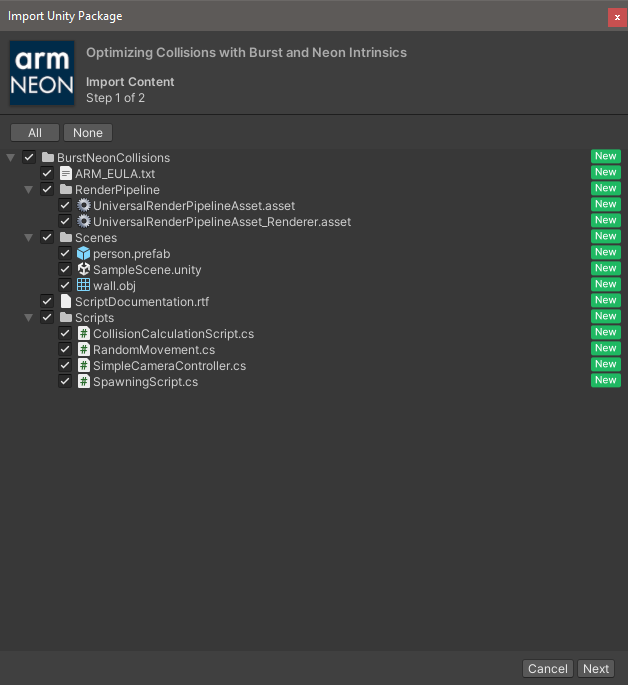

## Create a blank project
You'll need Unity installed with Android build support. Read [Get started with Unity on Android](/learning-paths/smartphones-and-mobile/get-started-with-unity-on-android) for help installing Unity and building, deploying to an Android device.

Although the sample application is a project, you will still need to create a blank project to import it into.

1. Open the Unity Hub

1. Log in if you are not logged in already

1. Select New Project

1. Select the 3D (URP) Core template

1. Enter project name (this will be used as the name of the project folder)

1. Enter location (path of your project on disk)

1. Select Create Project

Note that [Universal Render Pipeline](https://docs.unity3d.com/Packages/com.unity.render-pipelines.universal@17.0/manual/index.html) projects are recommended for mobile applications.

Unity will take a moment to create your new project and build the default assets.

## Download and install the sample application
Once Unity has loaded, you will be presented with a template project. You can ignore all of the assets provided by Unity. You will only need to concentrate on the files from the sample project.

1. Open a web browser

1. Open the  [sample project page](https://assetstore.unity.com/packages/essentials/tutorial-projects/optimizing-collisions-with-burst-and-neon-intrinsics-196303)

1. You will need to log in if you haven’t already

1. On the asset (Optimizing Collisions with Burst and Neon Intrinsics) page select Add to my assets button

1. The button will change to Open in Unity. Select it.

1. A popup window will ask to open the asset in Unity - you may do this by selecting the Open Unity Editor button

1. If Unity fails to open the asset or no popup appears, select My Assets button in the top-right of the page

    1. The assets you own should appear in a list

    1. Find the entry for Optimizing Collisions with Burst and Neon Intrinsics

    1. Select Open in Unity button

    1. A popup will appear as in step 6. Select Open Unity Editor

1. The Unity Editor will bring itself to the front and show the Package Manager

1. You will see the sample project listed and highlighted. Select Download.

1. Select Import

1. A warning message will appear because the sample project will replace the project settings in your current project. Since we have only just created this new project, it is fine to overwrite. Select Import.

1. A further warning may appear as the sample project has additional dependencies which our blank project hasn’t activated yet. Select Install/Upgrade.

1. The Import Unity Package window will appear. It allows individual files and folders to be imported or ignored. You will need all of the files in the project. Leave all items ticked and select Next.

    

1. A second window will open that lists the project settings that will be overwritten. We want the settings from the sample code so leave all items ticked. Select Import.

    

## Setup the project
Once the sample project has been imported you will see some errors and warnings.

1. Open File menu and select Build Settings

1. Select Android from the Platform list

1. Select Switch Platform

Unity will take a moment to build the assets for the Android platform.

The errors will disappear but some warnings regarding unreachable code will appear. These will be explained later but can be safely ignored for now.

Your scene view will look something like this:

## Run the project inside the editor
It’s worth checking that everything is imported and built correctly.

1. Close the Build Settings window

1. In the Project tab (usually at the bottom in default configurations) you will see the list of asset files.

1. Open the BurstNeonCollisions folder

1. Open Scenes folder

1. Open the scene called SampleScene

1. Select the Play (triangle) button to launch the program.

The game will launch and you will see any empty environment begin to fill with more and more characters (capsules) over time. It will look something like this:

## Deploy to Android
You will now deploy the sample to your Android device. Your device must already be setup for development. For detailed instructions read the learning path [Get started with Unity on Android](/learning-paths/smartphones-and-mobile/get-started-with-unity-on-android).

1. Open Build Settings from the File menu

1. Tick the Development Build option

1. Select Add Open Scenes to add the demo scene to your Scenes in Build list

1. Plug your Android device into your computer

1. Once recognised, your device will be listed in the drop-down menu next to Run Device

1. The screenshot below shows the settings with a Samsung S8 selected as the Run Device

1. Select Build and Run

    

1. Enter a name for the APK (the Android package) and select Save

Unity will take a moment to build the Android version and then automatically deploy it to your connected Android device. Depending on your setup, the build and deployment can take several minutes.

