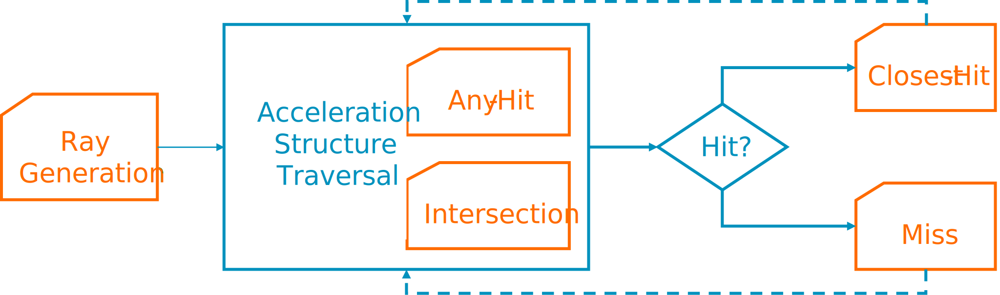
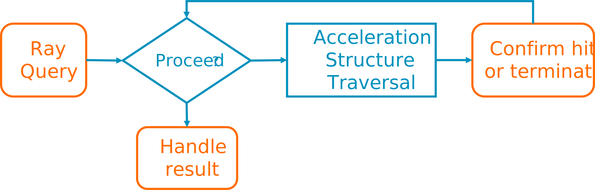

To control ray traversal, and launch rays, Vulkan offers two options:

### Ray tracing pipeline

The first option is to use `VK_KHR_ray_tracing_pipeline`. This is an opaque and more driver-managed approach. It uses a new set of shader stages to allow users to control ray traversal.

First, you can use a `Ray Generation` shader to define rays and set the origin and direction of each ray that you want to trace. As the GPU traverses the acceleration structure, it may call one of two shaders. If it intersects user-defined geometry, it will call the `Intersection` shader. If it intersects non-opaque geometry, it will call an `Any-Hit` shader to decide if the hit should be considered.

Once ray traversal is complete, one of two things can happen. If the ray does not hit anything in the scene, you call the `Miss` shader. A common use case of a `Miss` shader is to sample an environment map containing the sky.

If instead you have a confirmed hit, the GPU invokes our `Closest-Hit` shader. In this shader, you can then determine what data you need from the object that you intersected, and return that data to the `Ray Generation` shader. For example, you might illuminate the object and later store the generated color into an output image.



### Ray query

The `VK_KHR_ray_query` extension allows you to use ray tracing from existing shader stages. Usually, you will launch rays from `Compute` or `Fragment` shaders, but it is also possible to launch rays from other stages, such as `Vertex` or even `Ray Generation`.

This makes it easy to add ray tracing to existing shaders, but it means that you need to manage the ray traversal. However, in most cases. ray traversal is simple to manage:

* In the shader, you first define a ray using `rayQueryInitializeEXT` to set its ray parameters. 
* Then you can start ray traversal using `rayQueryProceedEXT`. 
* `rayQueryProceedEXT`  returns false once ray traversal is complete.
* In non-opaque geometry, you need to use `rayQueryConfirmIntersectionEXT` to confirm non-opaque candidates. 
* If you only have opaque geometry, you can call `rayQueryProceedEXT` and ignore its return value.



* Once the ray traversal is complete, you can use `rayQueryGetIntersectionTypeEXT` to query if you have hit something, or missed. 

If you hit something, you can use other ray query functions to query the data and use the result in your shader:

``` glsl
layout(set = 0, binding = 10) uniform accelerationStructureEXT top_level_acceleration_structure;

void trace_ray()
{
    rayQueryEXT rayQuery;

    // If possible, use gl_RayFlagsSkipAABBEXT combined with gl_RayFlagsCullNoOpaqueEXT
    // This will cull non-opaque geometry and enable compiler optimizations.
    const uint flags = gl_RayFlagsCullNoOpaqueEXT | gl_RayFlagsSkipAABBEXT;

    // Upper 24 bits ignored, if is 0 when combined with acceleration structure cull mask, the instance is ignored
    uint cull_mask = 0xFF;

    vec3 ray_origin = get_position();
    vec3 ray_direction = get_direction();
    float ray_t_min = 0.001;        // Will reject candidates if the distance is lower. Useful to avoid self intersection.
    float ray_t_max = 1e24;         // Will reject candidates if the distance is greater. Useful for point lights with a radius.
    rayQueryInitializeEXT(rayQuery, top_level_acceleration_structure, flags, cull_mask, ray_origin, ray_t_min, ray_direction, ray_t_max);

    // The geometry is opaque so you do not need to check the return value
    rayQueryProceedEXT(rayQuery);

    const bool committed_intersection = true;
    if (rayQueryGetIntersectionTypeEXT(rayQuery, committed_intersection) != gl_RayQueryCommittedIntersectionNoneEXT)
    {
        // Query some data from the ray hit, for example:
        uint intersection_custom_instance_id = rayQueryGetIntersectionInstanceCustomIndexEXT(rayQuery, committed_intersection);
        uint intersection_geometry_id = rayQueryGetIntersectionGeometryIndexEXT(rayQuery, committed_intersection);
        uint intersection_primitive_id = rayQueryGetIntersectionPrimitiveIndexEXT(rayQuery, committed_intersection);
        vec2 intersection_barycentrics = rayQueryGetIntersectionBarycentricsEXT(rayQuery, committed_intersection);
        bool intersection_front_face = rayQueryGetIntersectionFrontFaceEXT(rayQuery, committed_intersection);
        vec3 intersection_hit_distance = length(rayQueryGetIntersectionTEXT(rayQuery, committed_intersection) * ray_direction);

        // Handle ray hit. For example: do illumination.
    }
    else
    {
        // Handle ray miss. For example: sample environment map.
    }
}
```

### Do I use ray query or ray tracing?

For most simple examples, ray query usually offers better performance, and it is what is recommended to use for implementing ray tracing effects. At the time of writing, Mali devices in the market only offer ray query support. On Arm GPUs, ray query is hardware accelerated for both `Compute` and `Fragment` shaders, but it is recommended to use `Fragment` shaders, to benefit from frame buffer compression. For further information, see [AFBC best practices](https://developer.arm.com/documentation/101897/latest/Buffers-and-textures/AFBC-textures) to learn more.
