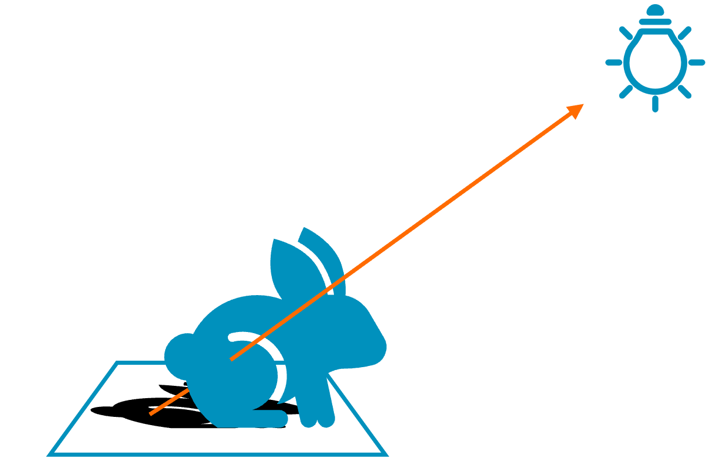

## Shadows

Light sources emit light that will illuminate most objects. However, not all the emitted light will reach all objects; some light rays will be intercepted by other objects before they can reach a light source. This process creates darker areas and produces some shadows in our images.


   
   
   
   
   
   


In our demo, we use a similar algorithm, to produce all our ray tracing effects. For shadows, similarly to what we did for reflections, we start by sampling some information from the G-buffer, like our position and normal. Then we use this information to generate shadows rays, that we can trace either using Ray Tracing Pipeline or Ray Query. If our shadow ray hits an object, it means that the ray is obstructed and we are in shadow, however, if the ray reaches the light without hitting anything it means that we are illuminated.


When tracing shadows we launch a ray from the objects towards the lights, so we will need to launch a separate ray for each light that casts shadows, so please, consider limiting the number of lights casting shadows in your scenes. Launching a single ray per light source will only allow us to produce hard shadows, but it is possible to obtain accurate soft shadows by launching multiple shadow rays and doing some area sampling, you can learn more in [this tutorial](https://medium.com/@alexander.wester/ray-tracing-soft-shadows-in-real-time-a53b836d123b). Soft shadows are more costly to produce, so evaluate if they are necessary.



In reflections and refractions, we need to know which object we hit to illuminate it. However, in shadows we only care about whether we hit an object or not; we do not need to know the exact object we hit. This allows us to skip accessing bindless resources for illumination, and we can use the GLSL flag `gl_RayFlagsTerminateOnFirstHitEXT`. With this flag, rays will terminate on the first confirmed hit instead of evaluating successive hits to verify which hit is closer. This optimization flag can allow us to skip multiple triangle intersection checks and improve our performance.

Another important optimization is that we know that objects not facing the light will always be in shadow, so we will not need to launch a shadow ray. This usually happens when the light is behind the object, and it is easy to check by calculating the dot product.

``` glsl
const uint LightTypeDirectional = 0;
const uint LightTypePoint = 1;

struct LightProperties
{
    vec3 directionOrPosition;
    vec3 color;
    float intensity;
    float range;
    bool cast_rt_shadows;
    uint light_type;
};

bool trace_shadow_ray(vec3 ray_orig, vec3 incident_dir, vec3 normal, float light_range)
{
    if (dot(normal, incident_dir) <= 0)
    {
        // Skip fragments that are not facing the light
        return false;
    }
    rayQueryEXT rayQuery;
    uint flags = gl_RayFlagsCullNoOpaqueEXT | gl_RayFlagsSkipAABBEXT | gl_RayFlagsTerminateOnFirstHitEXT;
    uint cull_mask = 0xFF;

    float ray_t_min = 0.001;        // Will reject candidates if the distance is less. Useful to avoid self intersection.
    float ray_t_max = light_range;
    // See reflection for an example of how to trace a ray query ray
    return !trace_ray(ray_orig, incident_dir, rayQuery, flags, cull_mask, ray_t_min, ray_t_max);
}

bool is_in_shadow(vec3 object_pos, vec3 object_normal, LightProperties light)
{
    switch (type)
    {
        case LightTypeDirectional:
        {
            if (!light.cast_rt_shadows)
            {
                return false;
            }
            vec3 incident_dir = -light.directionOrPosition;
            const float light_range = 1e24;        // Directional light have infinity distance
            return trace_shadow_ray(object_pos, incident_dir, object_normal, light_range);
        }
        case LightTypePoint:
        {
            vec3 object_to_light = light.directionOrPosition - object_pos;
            float light_distance = length(object_to_light);
            if (light_distance > light.range)
            {
                // Object too far from light
                return true;
            }
            else if (light.cast_rt_shadows)
            {
                return trace_shadow_ray(object_pos, incident_dir, object_normal, light.range);
            }
        }
    }
    return false;
}

void main()
{
    illuminated_hit_color = vec4(0);

    // Retrieve some data from the G-buffer
    // See reflections sample for more details
    vec2 g_buffer_uv = vec2(gl_FragCoord.xy) / current_resolution;

    ivec2 texture_size = textureSize(depth_sampler, 0);
    ivec2 depth_coord_texel = ivec2(g_buffer_uv * texture_size);
    float depth = get_g_buffer_depth(depth_coord_texel);
    if (depth <= 0)
        return;

    const vec3 pos = get_g_buffer_world_pos(g_buffer_uv);
    const vec3 normal = get_g_buffer_normal(g_buffer_uv);

    const vec4 material_properties = get_g_buffer_material_properties(g_buffer_uv);
    const vec3 normal = get_g_buffer_normal(g_buffer_uv);

    const vec3 base_color = get_g_buffer_base_color(g_buffer_uv);
    const vec3 emissive = get_g_buffer_emissive(g_buffer_uv);

    // Evaluate shadow for all lights
    for (uint light_idx = 0; light_idx < number_of_lights; ++light_idx)
    {
        if (!is_in_shadow(pos, normal, light_array[light_idx]))
        {
            illuminated_hit_color += get_pbr_color(pos, normal, camera_position, base_color, emissive, hit_material_properties);
        }
    }
}
```