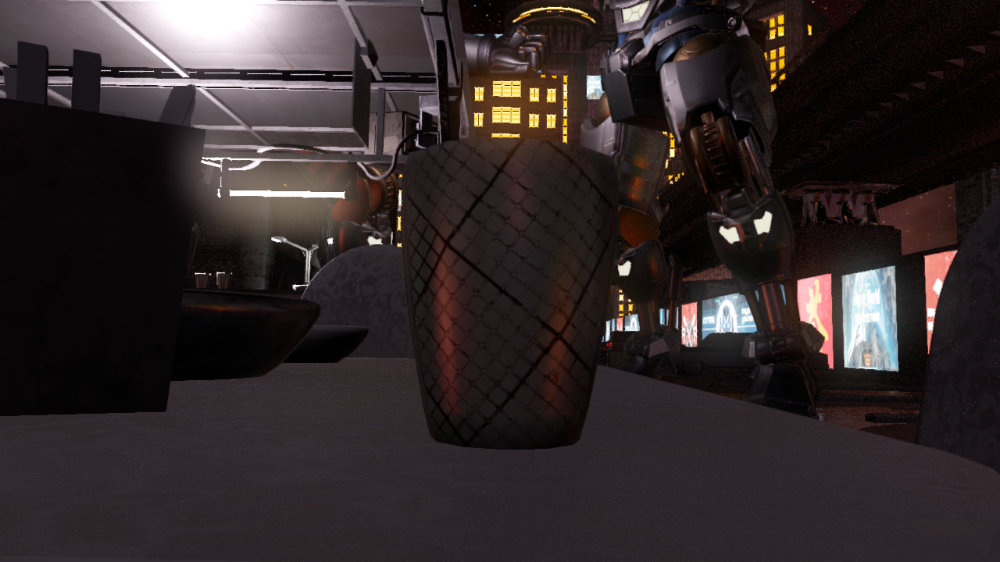
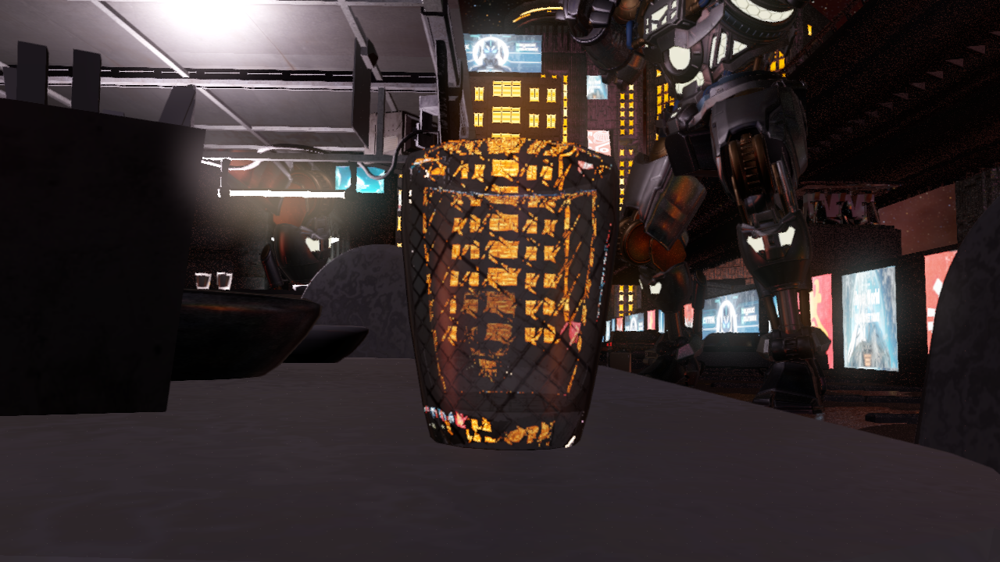
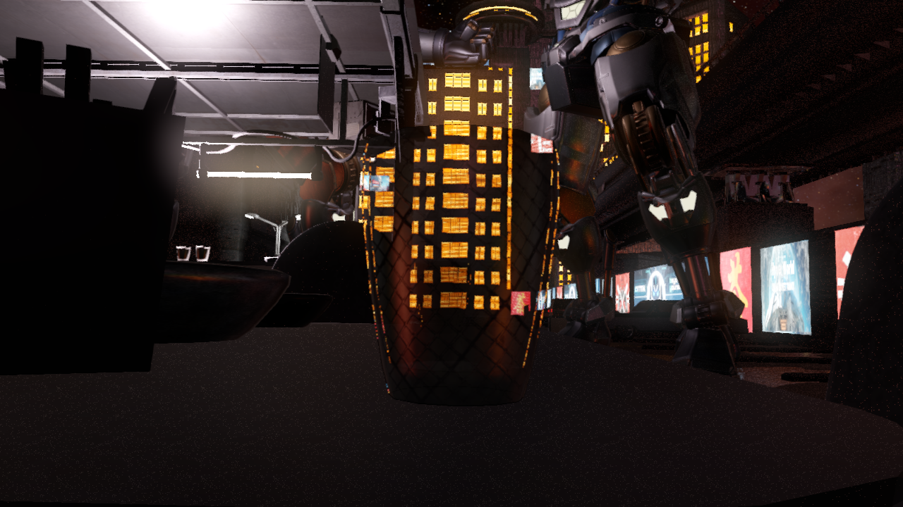
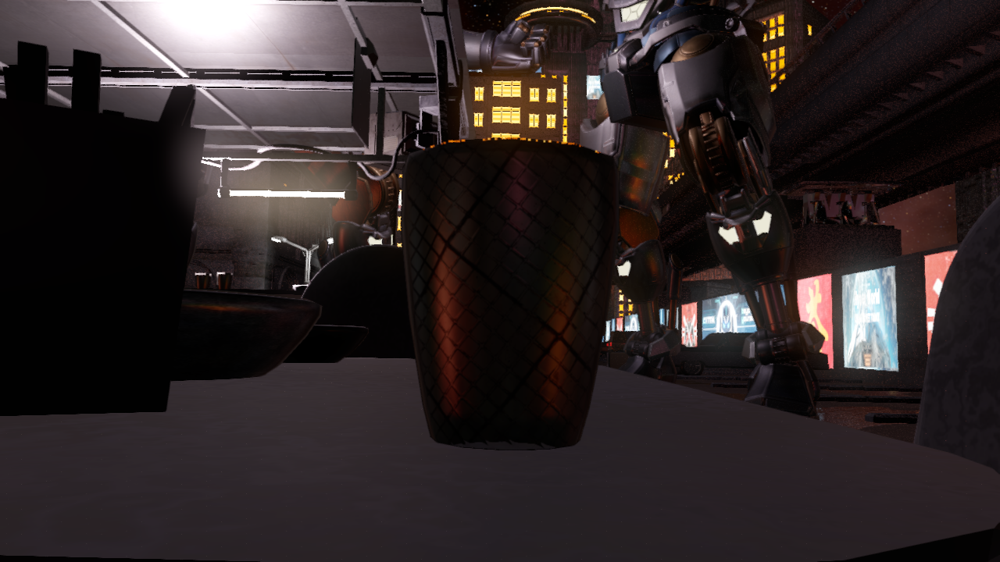
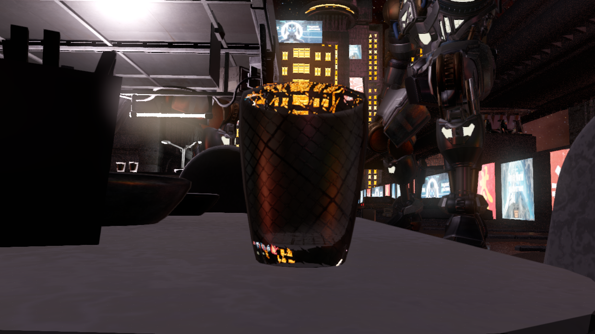
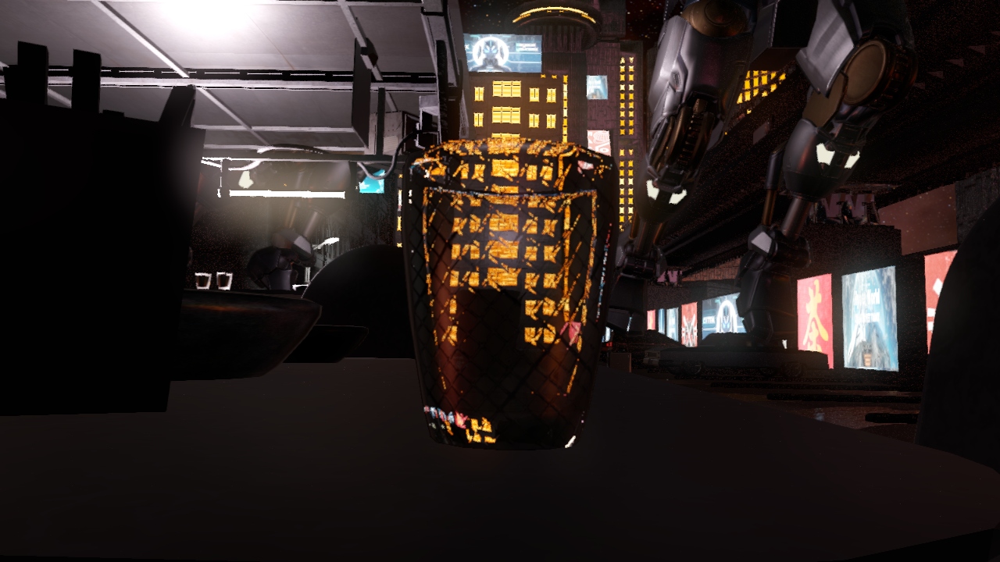

## Refractions

Refractions are one of the main advantages of ray tracing. They are extremely difficult to simulate using non ray tracing techniques, so most games do not use them yet.

To simulate transparency and opacity, we usually use an alpha texture, to indicate that the light can pass thought the object. At first glance transparency and refractions might look similar, but in a transparent material light goes through in a straight line, so light rays enter and exit the material in the same direction. Refractions bend the light inside the object and change the direction of the ray, allowing artists to create impressive effects that are not feasible without ray tracing. Transparency is a special case of refractions with a refraction index of 1.0, however there are more efficient and simple ways to simulate ray tracing transparency and opacity than using refractions.







Refractions are simulated using *Snell's law*. Similarly to reflections, GLSL has a built-in function `refract` that allows us to compute the direction of the refracted ray using the direction of the incident ray, the surface normal, and the ratio between materials' refraction indices.


Our refractions algorithm is like our reflection algorithm. We start by retrieving some information from the G-buffer like normal, position or refractive index. Then we use this information to generate our ray, that we trace using either Ray Tracing Pipeline or Ray Query.


Just like reflections, we use bindless to get the material information necessary to illuminate the hit object. Refractions require a careful handling of back faces and the blending of multiple layers to obtain a correct result. If we hit a back face triangle we are exiting the refractive material, so we will not illuminate the hit, but we will still need to refract the ray. Finally, we will need to do an inverse blending of all refracted hit results.


``` glsl
vec4 main()
{
    // Retrieve some data from the G-buffer
    // See reflections sample for more details
    vec2 g_buffer_uv = vec2(gl_FragCoord.xy) / current_resolution;

    ivec2 texture_size = textureSize(depth_sampler, 0);
    ivec2 depth_coord_texel = ivec2(g_buffer_uv * texture_size);
    float depth = get_g_buffer_depth(depth_coord_texel);
    if (depth <= 0)
    {
        o_color = vec3(0);
        return;
    }

    const vec3 pos = get_g_buffer_world_pos(g_buffer_uv);
    const vec4 material_properties = get_g_buffer_material_properties(g_buffer_uv);
    const vec3 normal = get_g_buffer_normal(g_buffer_uv);
    const bool is_refractive = get_material_is_refractive(material_properties);
    o_color = get_g_buffer_base_color(g_buffer_uv).rgb;

    const int MAX_BOUNCES = 4;        // Multiple bounces for refractions

    int remaining_ray_bounces = MAX_BOUNCES;

    bool is_valid_ray = remaining_ray_bounces > 0 && is_reflective;

    vec3 current_pos = pos;
    vec3 prev_pos = camera_pos;
    vec3 current_normal = normal;

    float inv_alpha = 1.0;

    // Launch a refraction ray
    while (is_valid_ray)
    {
        const vec3 incident_dir = normalize(current_pos - prev_pos);
        vec4 hit_material_properties = vec4(0);
        vec3 hit_pos = vec3(0);
        vec3 hit_normal = vec3(0);

        const vec3 ray_dir = refract(incident_dir, normal);
        // Evaluate ray using ray query.
        // See reflections form more details
        rayQueryEXT rayQuery;
        valid_hit = trace_ray(ray_orig, ray_dir, rayQuery);
        if (is_valid_ray)
        {
            vec2 hit_uv;
            uint material_id;
            obtain_rq_hit_data(rayQuery, hit_material_properties, hit_pos, hit_normal, hit_uv, material_id);

            const bool is_front_face = rayQueryGetIntersectionFrontFaceEXT(rayQuery, true);
            if (is_front_face)
            {
                // For back faces we bend the ray
                // For front faces we also compute the hit color
                // See reflection example for an example of how to illuminate a ray query hit
                vec4 refraction_color = vec4(0);
                illuminate_hit_data(hit_material_properties, hit_pos, hit_normal, hit_uv, material_id, illuminated_hit_color);

                float alpha = illuminated_hit_color.a;
                o_color += inv_alpha * alpha * refraction_color.rgb;
                inv_alpha *= 1.0 - alpha;
            }

            prev_pos = current_pos;
            current_pos = hit_pos;
            current_normal = hit_normal;
            is_refractive = get_material_is_refractive(hit_material_properties);
            remaining_ray_bounces -= 1;
            is_valid_ray = is_valid_ray && remaining_ray_bounces > 0 && is_refractive;
        }
    }
}
```

To obtain a good refractive result we will need to launch a ray with multiple bounces; to obtain a useful result we will need to use a minimum of 2 bounces. Increasing the number of bounces will produce better visual quality, however refractions are a costly effect, and launching rays with multiple bounces can have a significant performance cost, so one should considered the performance impact.








