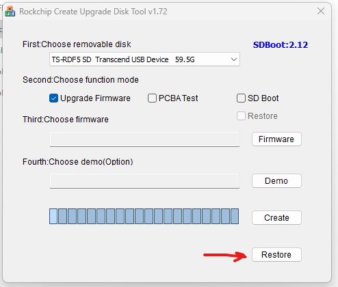
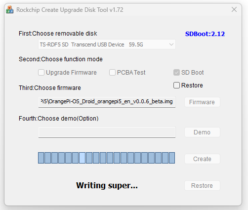

---
# User change
title: "How do I install Droid OS on the Orange Pi 5?"

weight: 2

layout: "learningpathall"
---

## What should I do before installing Droid OS on the Orange Pi 5?

You will need to do these steps on a Windows PC in order to run the required imaging software.
Currently, all files and documentation are found on a Google Drive belonging to Orange Pi.

[Manual](https://drive.google.com/drive/folders/1Bre2q0bGgXQuQlYaYDMvwstpvtHLmcgX)
[Droid OS Image and SDDiskTool_v1.72 Imaging Software](http://www.orangepi.org/html/hardWare/computerAndMicrocontrollers/service-and-support/Orange-pi-5.html)

## How do I download the Droid OS image?

1. Go to the [Orange Pi 5 support page](http://www.orangepi.org/html/hardWare/computerAndMicrocontrollers/service-and-support/Orange-pi-5.html).

2. Click Orange Pi OS(Droid) > TF Card Image (This will be inside Google Drive).

3. Download the latest image, as of the time of this writing OrangePI-OS_Droid_orangepi5_en_v0.0.6_beta.tar.gz

4. Use a program like 7-Zip to unpack the .tar.gz file, and then unpack the resulting .tar file, so that you end up with a .img file.

## How do I download the SDDiskTool_v1.72?

It is important to use the exact version of the SDDiskTool, version 1.72, otherwise it will fail.

1. Go to the [Orange Pi 5 support page](http://www.orangepi.org/html/hardWare/computerAndMicrocontrollers/service-and-support/Orange-pi-5.html).

2. Click "Official Tools".

3. Find "Android image writing tool-SDDiskTool" and download (This will be inside Google Drive).

4. Unzip the "SDDiskTool_v1.72" folder into a new folder.

5. Edit the "config.ini" file. Up at the top, where it says Selected=1, change to Selected=2. Otherwise the image writing tool will be in Chinese.

6. Run the SD_Firmware_Tool.exe file. You will probably have to tell Windows to Run Anyway.

7. Select the SD card from the dropdown list.

8. Format the disk by clicking Restore on the bottom right, then click Yes.

9. If the program closes you may need to open it again. It may also give you an error. You should still be able to proceed.

10. Check SD Boot.

11. Click the Firmware button and choose the .img file downloaded earlier.

12. Click Create.

13. After writing the image, you can exit the SDDiskTool software and eject the microSD card.

14. Insert the card into the Orange Pi 5 and then plug in the power.

## What is the initial Droid OS setup?

There isn't much to set up initially, just a few small items. All developer options should be turned on by default, but you can double check.

1. Plug in the ethernet cable

2. Click on Settings > Display > Display Size. Set to small.

3. Click on System > Developer Options. Turn on.

4. Scroll down the page in Developer Options and turn on USB debugging.
