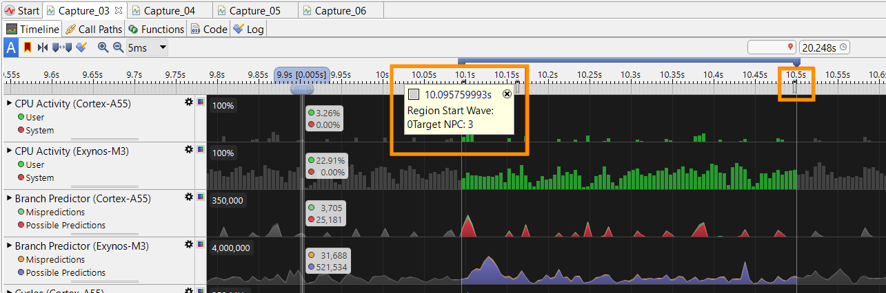
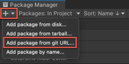
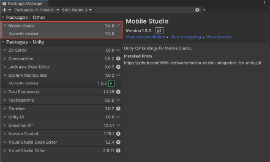
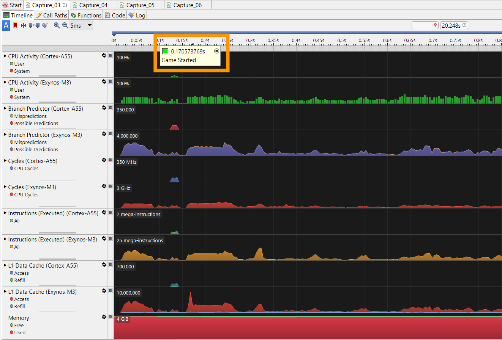
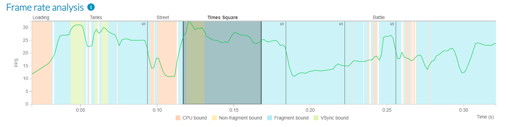
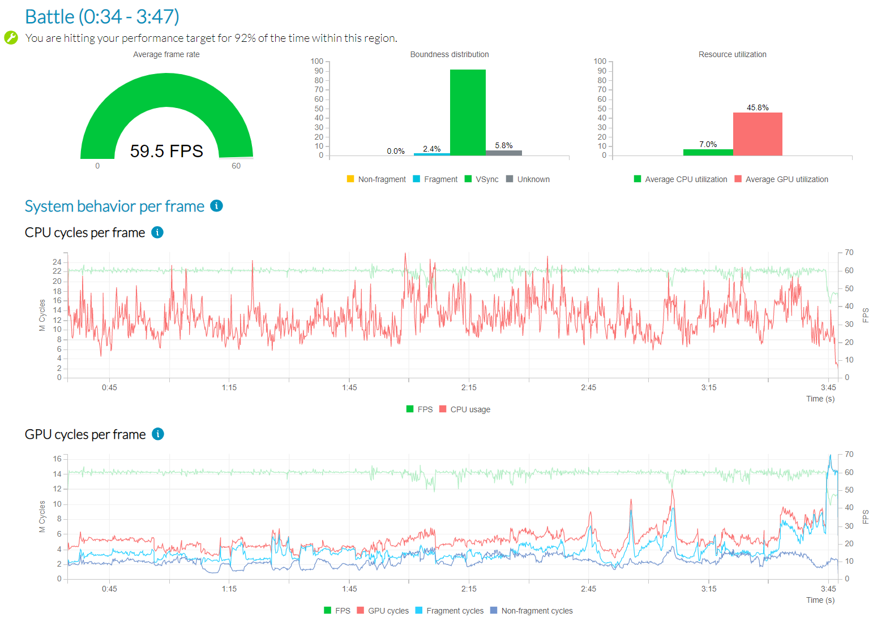
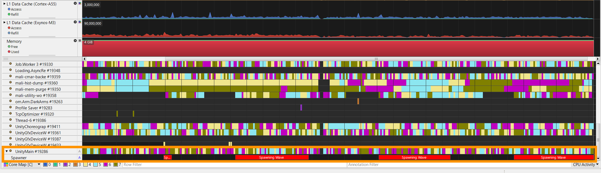
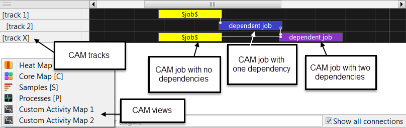

## Arm Performance Studio Unity integrations

[Arm Performance Studio](https://developer.arm.com/Tools%20and%20Software/Arm%20Performance%20Studio) is a free suite of analysis tools to help you profile game performance on mobile devices with Arm CPUs and GPUs. Arm provides a Unity package to make data from Unity games visible in the Arm Performance Studio tools, [Streamline](https://developer.arm.com/Tools%20and%20Software/Streamline%20Performance%20Analyzer) and [Performance Advisor](https://developer.arm.com/Tools%20and%20Software/Performance%20Advisor).

This package provides a simple way to incorporate annotations into your Unity project. These annotations enable you to mark the timeline with events or custom counters which provides valuable context alongside the performance data in Streamline, so you can see what was happening in the game when bottlenecks occur. For example, here we can see markers that highlight where a wave of enemies is spawning:



{}
The Performance Studio package is supported with the Unity Editor version 2018.4 LTS and later.
{}

### How to install the Unity Performance Studio package

1. In Unity, go to **Window > Package Manager**.

2. In the top left corner, click the **+** icon and select **Add package from git URL…**.



3. Enter the git URL `https://github.com/ARM-software/mobile-studio-integration-for-unity.git` and click **Add**. When the install completes, you should then see **Mobile Studio** in your list of installed packages.

    {}
    You must use the exact Git Repository URL including the extension “.git”.
    {}

    

    {}
    From 2024.0, Performance Studio is the new name for Mobile Studio. This package still uses the old name, but all functionality is supported in the latest versions.
    {}

### Adding single markers to a Unity project

The simplest annotations are single markers, which can have a name and a color. To use them in a Unity project where you have installed this package, simply call into the Mobile Studio library as follows:

```console
private void Start()
{
    MobileStudio.Annotations.marker("Game Started", Color.green);
}
```

This will emit a timestamped marker with the label "Game Started", with the color green. When you capture a profile in Streamline, you can see this marker along the top of the timeline at the point that the game starts.



### Defining regions in a Unity project

To define regions of interest within the game, you can specify a pair of markers prefixed with “Region Start” and “Region End”, for example:

```console
MobileStudio.Annotations.marker("Region Start Times Square");
// Do work
MobileStudio.Annotations.marker("Region End Times Square");
```

These regions are shown on the frame rate analysis chart in the Performance Advisor report.



Also, dedicated charts for each region are appended to the end of the report, so you can analyze each region independently.



{}
Performance Advisor cannot capture frame data from devices running Android 9 for apps built with Unity 2021.2 or later. Refer to [this FAQ](https://developer.arm.com/documentation/102718/0102/Performance-Advisor-fails-to-capture-frame-data-from-Unity-applications-on-Android-9) for further details.
{}

### Using channels in a Unity project

Channels are custom event timelines associated with a software thread. You can create channels and place annotations within them. A channel annotation has a text label and a color but, unlike markers, they span a range of time.

To create a channel called "Spawner" and insert an annotation called "Spawning Wave", with the color red:

```console
private MobileStudio.Annotations.Channel channel;
private void Start()
{
    channel = new MobileStudio.Annotations.Channel("Spawner");
}
// Annotations can then be inserted into a channel:
private void HandleNewWaveStartedEvent()
{
    channel.annotate("Spawning Wave", Color.red);
}
private void HandleWaveCompleted(object sender, EventArgs e)
{
    channel.end();
}
```

To see channels in Streamline, select the **Core Map** view, and expand the **UnityMain** thread:



### Creating counters

Counters are numerical data points that can be plotted as a chart in the Streamline timeline view. Counters can be created as either absolute counters, where every value is an absolute value, or as a delta counter, where values are the number of instances of an event since the last value was emitted. All values are floats and will be presented to 2 decimal places.

When charts are first defined, you can specify a title and series name. The title names the chart, the series names the data series.

Multiple counter series can use the same title, which means that they will be plotted on the same chart in the Streamline timeline.

To create a counter:

```console
counter = new MobileStudio.Annotations.Counter("Title", "Series", MobileStudio.Annotations.CounterType.Absolute);
```

Counter values are set easily as shown below:

```console
counter.setValue(42.2f);
```

### Custom Activity Maps

[Custom Activity Map (CAM)](https://developer.arm.com/documentation/101816/0806/Annotate-your-code/User-space-annotations/Custom-Activity-Map-annotations) views allow execution information to be plotted on a hierarchical set of timelines. Like channel annotations, CAM views plot jobs on tracks, but unlike channel annotations, CAM views are not associated with a specific thread. CAM Jobs can also be linked by dependency lines, allowing control flow between them to be visualized.

CAM annotations allow you to define and visualize the execution of a complex dependency chain of jobs. Each CAM view contains one or more tracks and each track contains one or more jobs. Tracks can also be nested hierarchically.



To create a custom activity map and add tracks to it:

```console
private MobileStudio.Annotations.CAM gameCAM;
private MobileStudio.Annotations.CAM.CAMTrack waveTrack;
private MobileStudio.Annotations.CAM.CAMTrack uiTrack; 
private void Start()
{ 
    //Create the CAM
    gameCAM = new MobileStudio.Annotations.CAM("Game Activity");

    // Add tracks to the CAM
    waveTrack = gameCAM.createTrack("Wave Activity");
    uiTrack = gameCAM.createTrack("UI Activity");

    // Create a nested track inside another track
    windTrack = waveTrack.createTrack("Wind activity");

}
```

To create a job within a track, there are two methods. The first is an immediate-mode API which starts a job when it is created, and stops it when the job's `stop()` method is called.

```console
private MobileStudio.Annotations.CAM.CAMJob waveJob;
private void HandleNewWaveStartedEvent()
{
    waveJob = waveTrack.makeJob("Spawning Wave", Color.red);
}
private void HandleWaveCompleted(object sender, EventArgs e)
{
    waveJob.stop();
}
```

The other method is to store the start and end times of your work, and then add them to the track later.

```console
UInt64 startTime = MobileStudio.Annotations.getTime();
// Do work
UInt64 endTime = MobileStudio.Annotations.getTime();

// Register the work done earlier
uiTrack.registerJob("UI Active", Color.blue, startTime, endTime);
```

The advantage of the second approach is that the `getTime()` method is very cheap in terms of CPU cycles, and can also be safely invoked from jobs running within the Unity Job Scheduler.

To allow dependencies between jobs to be expressed, both `makeJob()` and `registerJob()` accept an optional list of `CAMJob` objects, which indicate the producers that the new job consumes from.
