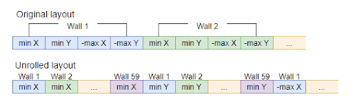

This section will first go through optimizations you can make to your code and data to make it friendly to the Burst compiler. This will enable it to optimize your code better.

## Preparing your project for Neon

In order to leverage Neon intrinsics in code, you first have to ensure that your project is using the Burst package.

### Enable Burst package

1. In the Window menu, select Package Manager

1. Ensure Packages option in top left is set to “Unity Registry”

1. Search for “burst”

1. Select Burst from the list on the left

1. If Burst is already installed it will be ticked. If not, select install

### Turn off ARMv7 architecture support
Neon intrinsics in Unity require ARMv8.

1. Select _Project Settings_ from the _Edit_ menu

1. Select _Player_ from the list on the left

1. In the right-hand panel, scroll to _Target Architectures_ under _Other settings_

1. Ensure ARMv7 is _not_ ticked

1. Ensure ARMv8 is _ticked_

### Allow unsafe code
We need to make use of memory pointers. 

1. Remain in _Player_ settings

1. Scroll to _Script Compilation_ area

1. Enable _Allow unsafe code_

## The Burst compiler
As you’ve already learned, the Burst compiler translates .NET bytecode to optimized native code. It is not applied across the whole of your project and there are some limitations as it doesn’t support all features of C#.

### How is the Burst compiler used?
The Burst compiler can be used with the job system or with static functions. The following is an example of a Burst job:

```
using Unity.Burst;
using Unity.Jobs;
   ...
[BurstCompile]
struct MyJob : IJob
{
  public void Execute()
  {
    ... your code ...
  }
}
```

Create your job struct based on IJob and write your code inside the _Execute()_ function. The attribute [BurstCompile] tells Unity to use the Burst compiler.

Alternatively you can use Burst static functions; that is, static functions tagged with the [BurstCompile] tag.

When running your app inside the Unity editor, your code will be compiled just-in-time (JIT). When built for your target platform, the code is compiled ahead-of-time (AOT).

### Support for subset of C#
The Burst compiler only supports a subset of C# named [High Performance C#](https://docs.unity3d.com/Packages/com.unity.burst@1.8/manual/csharp-hpc-overview.html). You should check the [C# language support](https://docs.unity3d.com/Packages/com.unity.burst@1.8/manual/csharp-language-support.html) for the version of Burst you are using.

At time of writing, the limitations included (but not limited to) the following:

1. Exceptions may behave differently (in HPC# _finally_ blocks are not called)

1. _foreach_ and _while_ are supported but you may get an error if the enclosing function has one or more generic collection parameters

1. _catch_ is not supported

1. Methods related to managed objects, e.g. _string_ is not supported

Some limitations may be removed over time as the Burst compiler is updated.

### Why use the Burst compiler?
With minimal effort from the programmer, the Burst compiler is able to produce highly optimized native code. Part of this optimization is the ability to produce Neon native instructions. Neon instructions are great at processing multiple data items at once; i.e. processing multiple data items in parallel rather than one at a time (or scalar operations).

## Auto-vectorization
Producing vector-based instructions from code is called vectorization. The Burst compiler is capable of auto-vectorizing code; i.e. the programmer doesn’t have to write Neon instructions. And it can do an even better job if we follow a few simple rules (or best practice).

### Best practice
The way data and code are structured are very important factors that will influence the compiler’s ability to auto-vectorize.

- Keep your code loops simple and small rather than large and complex

- Where multiple data items are processed with the same operation, keep those data items together in contiguous memory (there are vector instructions for fetching, processing and saving multiple data items at once if they are in contiguous memory locations). This will also help cache efficiency.

- Where the same operation is performed multiple times, try to keep those operations sequential in your code

- Where possible, use fixed-length _for_ loops (they are easier for the compiler than while loops with arbitrary exit conditions)

- Declare fixed-length _for_ loop counts of multiples of 4 or 8 (avoids the compiler having to produce _tail-handling_ code; i.e. code that handles the odd remaining data items)

- Avoid _break_ in loops

- Function calls in loops should be inlined where possible

- Use simple indexing as indirect addressing can be more difficulty for the compiler to vectorise

- Large data passed to a function will be passed using pointers. Those functions should be tagged with [NoAlias]. This tells the compiler that no overlaps occur in the pointers and the code is fine to be vectorized.

- Don’t try to optimize every line and every function

- Measure, optimize and check; iteratively make changes, measuring performance before and after to ensure each change is an improvement

- Use Hint intrinsics such as _Assume_, _likely_, and _unlikely_. Read about [hints in the Burst documentation](https://docs.unity3d.com/Packages/com.unity.burst@1.8/manual/optimization-hint.html)

### Modifications to collision sample to aid auto-vectorization
The following changes were made from the plain code (unoptimized) version:

1. Install Burst and use [BurstCompile] on key functions

1. Collision detection routines were moved to static Burst functions

1. Struct data such as AABBs stored as single array of floats

1. Aggressive inlining was used by applying _[MethodImpl(MethodImplOptions.AggressiveInlining)]_ to key functions

## Writing Neon intrinsics
Before diving into the modifications made to optimize for Neon, here are some points to consider when investigating Neon for your own projects:

1. The Burst compiler does a great job on it’s own but Neon intrinsics can help get a little bit more performance

1. Neon intrinsics let you use a high level language while still accessing the low level native instructions you need.

1. The compiler won’t always recognise code that is vectorizable so it’s worth checking what is and isn’t getting vectorized. The [Unity Burst Inspector](https://docs.unity3d.com/Packages/com.unity.burst@1.8/manual/editor-burst-inspector.html) can help you identify which areas of your code are using Burst..

1. Writing Neon code can be complex.

1. Must use static Burst function or jobs. There is an overhead to using jobs. In the collision sample, simply activating Burst and converting the code to the job system did not provide an improvement; other optimizations had to be made.

1. You can use _if (IsNeonSupported)_ to fall back to non-Neon code. _IsNeonSupported_ has no runtime overhead

1. Not all Neon intrinsics are supported. Check the [Burst documentation](https://docs.unity3d.com/Packages/com.unity.burst@1.8/manual/index.html).

Neon intrinsics can be used within Burst static functions or Burst jobs. To use Neon within a static function you simply tag it with the same [BurstCompile] tag we used previously. You will also want to use best practice such as [NoAlias] and unsafe with pointer parameters.

```
[BurstCompile]
static unsafe void DoSomething([NoAlias] in float* inputs, [NoAlias] float* outputs)
{
  ... your code ...
}
```

### Modifications made to implement Neon intrinsics in collision sample
Because the Burst compiler did such a good job, further structural changes were required to really get the most from the Neon intrinsics implementation.

- In radius collision detection we increase simultaneous comparisons to 8

- Compare character with 8 walls at once (2 lots of 4)

- The sign of some values changed so that all comparisons became a vectorized _greater than_ operation (more on this below)

- Wall collision data layout was changed to separate all values into their own array (each wall  has four floats (min.x, min.y, max.x, max.y) which were split into 4 arrays)

This diagram shows how we changed from having each wall fill a 4-element vector, to separate arrays so each vector holds values from 4 walls.



The character-wall collision detection is performed in _NeonAABBObjCollisionDetectionUnrolled_.

The function loops over all characters and compares each against all the walls. The inner Neon code is performing 4 character-wall comparisons using vectors. The code is repeated (unrolled) to effectively deal with 8 character-wall collision detections per loop iteration.

Each character-wall collision is detected using a vectorized version of the _Intersects_ function of _StaticCollisionObject_. It is checking if two AABBs overlap. Some changes to the algorithm have been made to make it more suitable for vectorization:

```
For all characters
{
    For number of walls / 8
    {
        For 4 walls
        {
            Check collision for wall against character
        }
        For next 4 walls
        {
            Check collision for wall against character
        }
        Combine 8 results and write out to memory
    }
}
```

The actual AABB-intersection function is also slightly modified to be more vectorizable. The sign of some AABB data is flipped so that all of the comparisons use _greater than_. The algorithm for an individual character-wall collision check then becomes:

```
bool Intersects(AABB wall, AABB character) {
  return !(
    wall.MinX > character.MaxX ||
    wall.MinY > character.MaxY ||
    wall.NegMaxX > character.NegMinX ||
    wall.NegMaxY > character.NegMinY
  )
}
```

NOTE. _Intersects_ and _AABB_ do not exist in the code and are only here for illustrative purposes only.

Here is a breakdown of some of the Neon intrinsics that were used to optimize the collision sample. Line numbers have been provided as you may want to follow along in _CollisionCalclationScript.cs_.

```
Line 721: var tblindex1 = new Unity.Burst.Intrinsics.v64((byte)0, 4, 8, 12, 255, 255, 255, 255)
```
Create a 64-bit vector with 8 8-bit elements with values (0, 4, 8, 12, 255, 255, 255, 255). This is used as a lookup table on _line 741_.

```
Line 728: charMaxXs = vdupq_n_f32(*(characters + c))
```
Duplicate floating point value into all 4 lanes of the 128-bit returned vector. The returned vector will contain 4 copies of a single _Max X_ value (of character bounds).

```
Line 736: wallMinXs = vld1q_f32(walls + w)
```
Load multiple floating point values from memory into a single vector register. The returned vector will contain _Min X_ values from 4 different walls.

```
Line 741: vcgeq_f32(wallMinXs, charMaxXs)
```
Floating point comparison (greater-than or equal). Compares 4 walls at once with a character’s _Max X_. Each of the four results will either be all ones (true) or all zeros (false).

```
Line 741: vorrq_u32(vcgeq_f32(wallMinXs, charMaxXs), vcgeq_f32(wallMinYs, charMaxYs))
```
Bitwise inclusive OR. The nested calls to _vcgeq\_f32_ are comparing the walls (Min X and Min Y) against the character’s Max X and Max Y. The four comparison results are combined with a bitwise OR. 

```
Line 741: results = vqtbl1_u8(_result of ORs_, tblindex1)
```
Table lookup function that selects elements from an array based on the indices provided. The result of the OR operations will be treated as an array of 8-bit values. The values from _tblindex1_ (0, 4, 8 and 12) ensure that we select the most significant bytes from each u32 OR result. So 4 character-wall comparisons are being merged into one 128-bit vector along with 4 dummy (because of the _out of range_ values in tblindex1) that will be replaced later with the 64-bit value of the next 4 wall comparisons (from _wmvn_u8_).

```
Line 751: vqtbx1_u8(results, …)
```
Table lookup function except that when an index is out of range, it leaves the existing data alone. This has the effect of selecting 4 bytes (using indices from _tblindex2_) from the results of the last 4 comparisons and combines it with the previous 4 results. _results_ will now contain the results of 8 wall-character comparisons.

```
Line 751: results = vmvn_u8(...)
```
Bitwise NOT operation. This negates each of the 8 character-wall comparisons. It is effectively the _!_ (NOT) in our intersect function; except that it is working on 8 results instead of 1.

```
Line 755: *(Unity.Burst.Intrinsics.v64*)(collisions + (c * numWalls + w - 4)) = results;
```
This is a vectorized form of writing out the 8 results to memory all at once. At time of writing, Burst doesn’t include the _VSTR_ Neon intrinsic.

### Character-character collision detection
This is left as an exercise for the reader. You may wish to explore the _NeonRadiusObjCollisionDetectionUnrolled_ function starting on line 561 of _CollisionCalculationScript.cs_.

## Additional notes
The sample project increases the character count over time. Because of this it was better to profile using later frames. In early frames there aren’t enough characters so the overhead of vectorization counters any gains.

An early implementation used Burst Jobs. The jobs got in the way of performance timing because they are not guaranteed to execute immediately.

[NoAlias] had a big impact on the performance gains (without it some optimizations produced little to no gain).

The job implementations have been left in the code for you to experiment with. Leveraging jobs in your own projects can lead to important performance gains when used appropriately.

The sample code displays some timing data on screen. It used _System.Diagnostics.Stopwatch_ to get accurate timings.

It may sound obvious but don’t use the optimizations when they are slower! For the collision sample, the best gain is when there are lots of characters but early on, there aren’t that many. So when there aren’t many characters in the scene, the code could switch to whichever is the fastest version.
