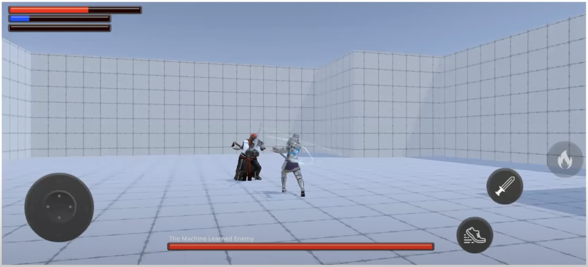

### What problem are we trying to solve?

Machine Learning has many potential applications across various platforms. One particular use case is implementing realistic behavior for non-player characters and opponents in video games. In this learning path, we will utilize the Unity Machine Learning Agents toolkit to build an "AI brain" within a game environment.

Creating rich, realistic AI for games is challenging, especially as project complexity increases. Traditional solutions often require extensive specialized coding and tools. With machine learning, we can avoid specialized code and instead leverage a generic approach to building smart AI-powered opponents with varying levels of difficulty.

### What are we going to create?

We will be using a Unity game template that we have prepared for this learning path to implement AI for a fighting game with two characters. The characters in this game will be battling in a 3D arena. One fighter will be controlled by the human player, while the other will be controlled by the "AI brain."

### How do this game template and its AI work?

Machine learning applications are built in two stages:

First, a "model" is trained in the "training" stage.

Next, this pre-trained model is used at runtime of the final application (the game) to make smart decisions and actions. This is the "inference" stage.

Inference usually runs on a different platform than the one used for training the model. The system and hardware requirements for these stages are very different.

The Unity game template we prepared uses the Unity Machine Learning (ML) Agents toolkit. This toolkit provides tools for both training and inference. It also supports two types of machine learning: "Imitation Learning" and "Reinforcement Learning."

Imitation Learning uses an "expert" for the AI to learn from while Reinforcement Learning uses "rewards and punishments".

We will focus on Reinforcement Learning.

Let's start by installing the necessary tools before diving deeper.
