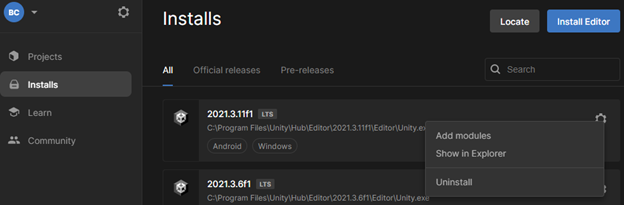
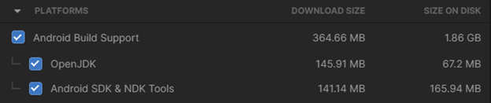
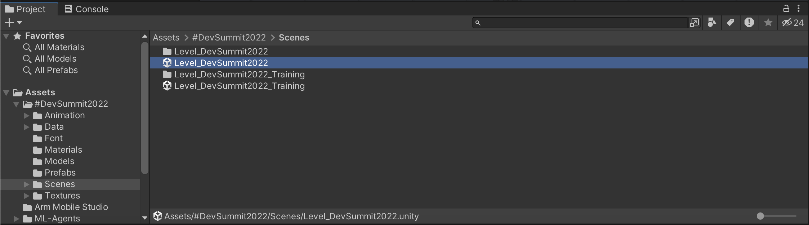
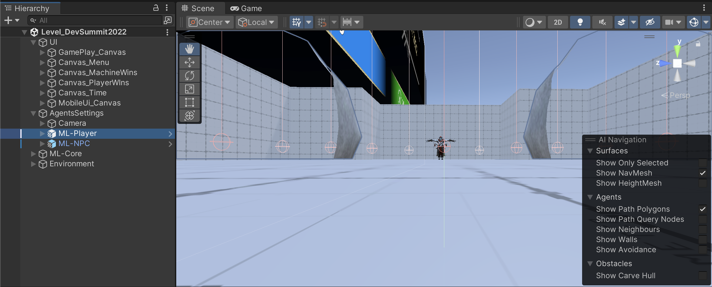
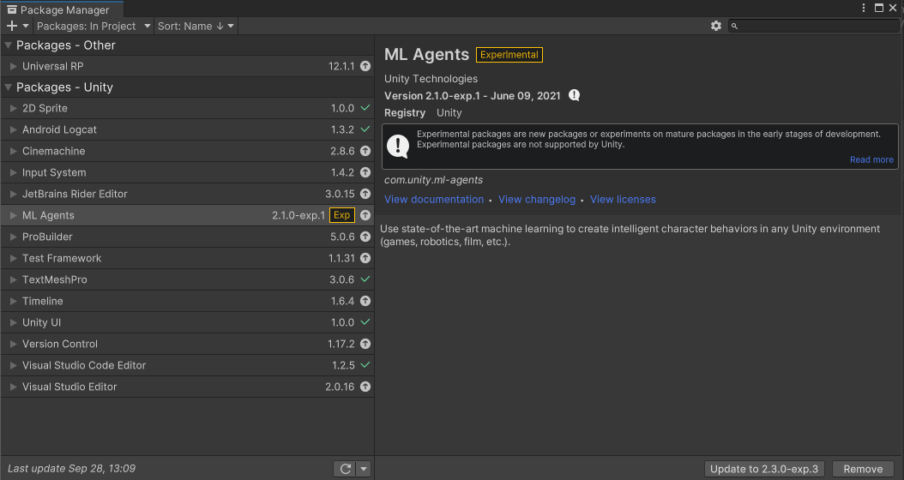

# Required Installations

## Install Unity
If you do not have a version of Unity installed:
1. Download and install the [Unity Hub](https://unity3d.com/get-unity/download?ref=personal)

Note that Personal licenses are free, and if running on Windows you will need Windows 10 or 11 and a GPU with DX10 capabilities. If running Unity on a Mac or Linux you will need to adapt these instructions.

2. In your Unity Hub download and install Unity version 2021.3.11f1. Later releases may well work, but this has been tested on 2021.3.11f1.
    * In Unity Hub go to **Installs** and click **Install Editor**
    * Go to the *Archive* page and find version 2021.3.11f1
    * The install will take approximately 7.21GB of disk space including Android deployment options

3. Add Android Build support 
    * Click the *Settings* icon and choose *Add Modules*
    * Under **Dev Tools**, choose *Microsoft Visual Studio Community 2019* if you wish to install it. This integrates well with Unity as a code editor, but any editor will do for editing scripts
    * Under **Platforms**, choose *Android Build Support*. Also make sure to choose *OpenJDK* and *Android SDK & NDK Tools* as well
    * Press *Continue*, and then agree to the Android SDK and NDK License Terms to install everything

## Install Python
In command or terminal prompt:
1. Install python 3.7.9 (or a later 3.7), and pip 20.1.1 or later. The official python installer can be found on:
https://www.python.org/downloads/
2. Ensure pip is installed by following the instructions for your operating system on this page: https://pip.pypa.io/en/stable/installation/

# Without our pre-built assets

## Steps
You will need to:

- Checkout [ML-Agents](https://github.com/Unity-Technologies/ml-agents)
- Follow [instructions](https://unity-technologies.github.io/ml-agents/Installation/) there to install PyTorch and ML Agents and then integrate with your own assets and code.

# With our pre-built assets (path of least resistance)

## Pre-requisites

You need to:
* Unzip the [ML Agents Workshop Supporting Files](MLAgentsWorkshopSupportingFiles.zip) into an appropriate location for Unity Assets

## Install PyTorch and ML Agents
1. Change directory to where you’ve unzipped the workshop scene. Then create a python virtual
environment: (note that you may need to use `python3` instead of `python`, depending on your install)

`md python-envs`
`python -m venv .\python-envs\mlagents-r18-env`

2. Activate the virtual environment:

`.\python-envs\mlagents-r18-env\Scripts\activate`

3. Install PyTorch:

`pip install torch==1.7.1 -f https://download.pytorch.org/whl/torch_stable.html`

This includes Tensorboard, which will be used during the workshop.

4. Install ml-agents python package:

`python -m pip install mlagents==0.28.0`

5. Downgrade protobuf to work with tensorboard:

`pip install protobuf==3.19`

If this complains use the `-I` option to force it.

## Project Setup 
1. Within Unity open the project directory
2. Once the project is imported, navigate to the _Project_ tab, then to _Assets->#DevSummit2022->Scenes->Level_DevSummit2022_ and select it (See Figure 1.)

3. Double click the aforementioned scene to load it.
5. Right click on _ML-Player_ and select _Align View to Selected_
6. The scene should now look like the one in Figure 2.

7. Check that the Package Manger is updated and everthing is correctly installed by navigating to _Window->Package Manager_. The screen that appears should look similar to Figure 3.
