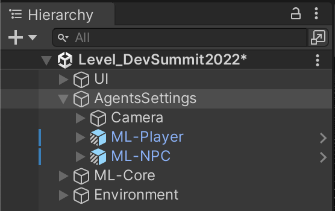
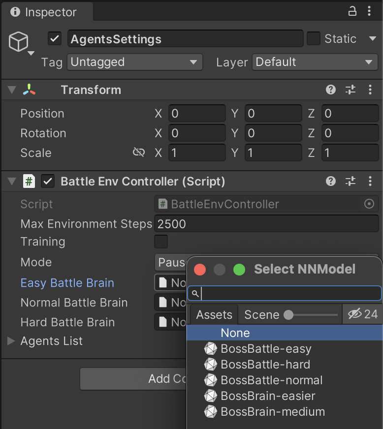
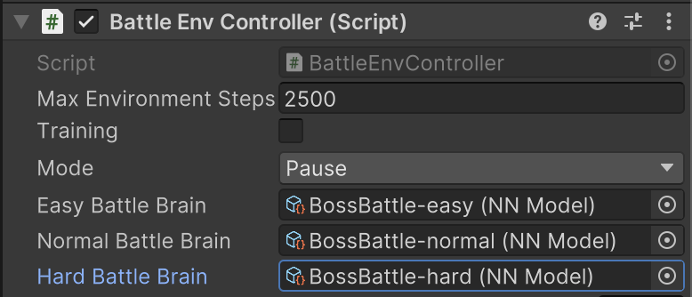
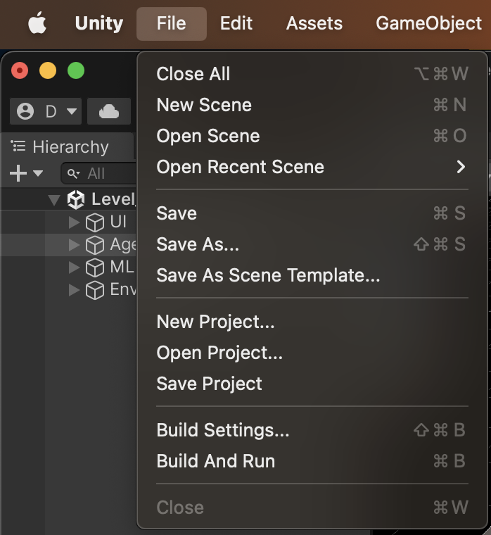
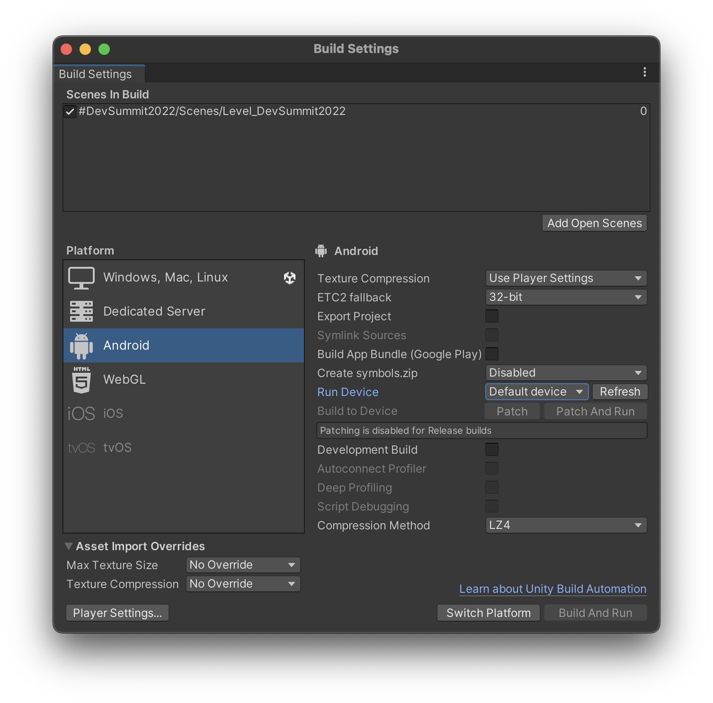
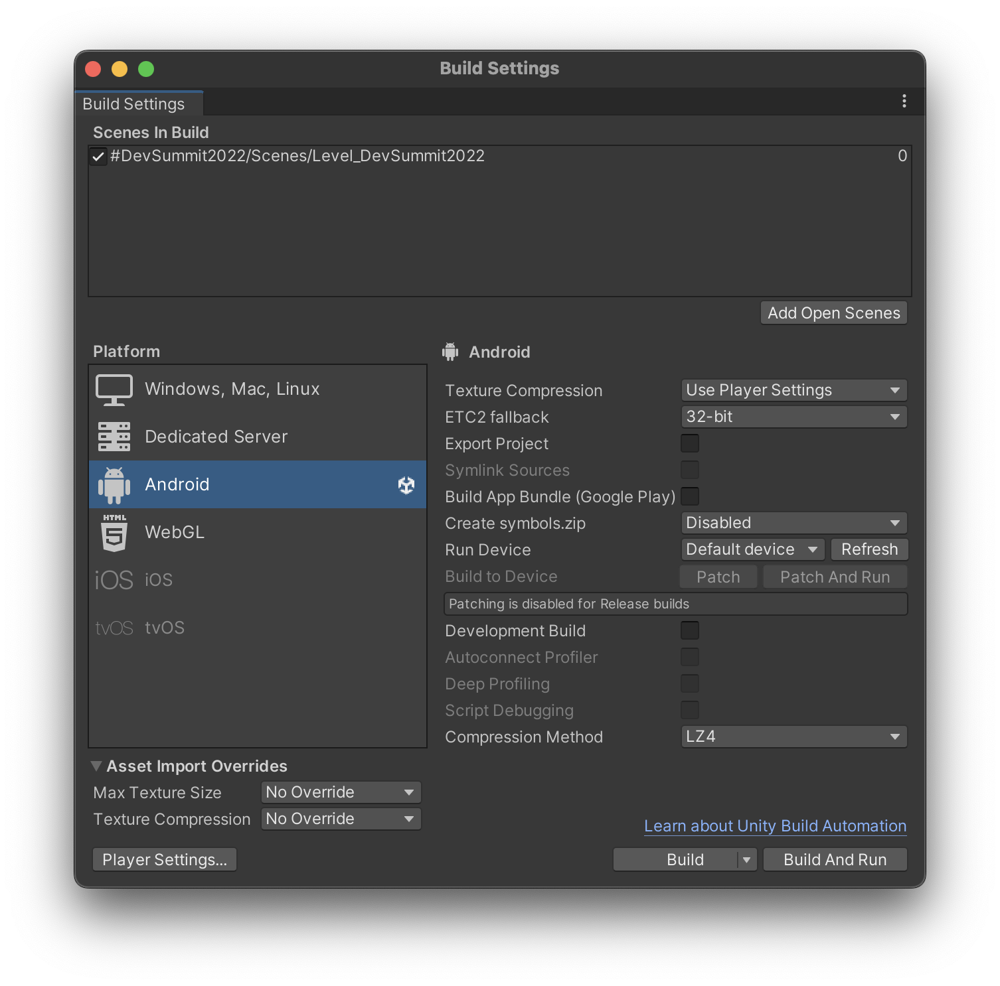
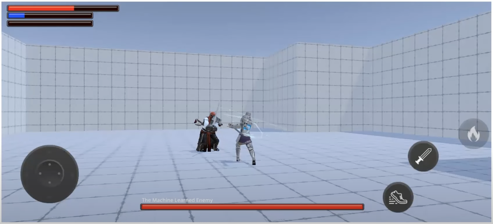

# Using some previous training

1. Now select the _Agent Settings_ object, in the _Heirachy_ tab, on the left.

2. Now on the right hand side in the _Inspector_ scroll to the _Battle Env Controller (Script)_ and you should see properties for _Easy Battle Brain_, _Normal Battle Brain_ and _Hard Battle Brain_.

3. Next to the _Easy Battle Brain_ there is a cirle. Click it to pop-up the _Select NN Model_ menu, as per Figure 2. 

Use the slider, in the pop-up, to change the list's detail view.

4. Now match up each Battle Brain property to it's respective NN Model.

5. Once the brains are set we can launch the game in the Unity Editor, to make sure everything is working and wired up correctly. If you select "Demo" mode you can see the 2 ML agents battle it out.

# Getting it running on an Android device
1. Make sure your Android device is in [developer mode](https://developer.android.com/studio/debug/dev-options#enable). This will allow Unity to deploy to it. If you Android phone is from a company not mentioned in the aforementioned link, you may have to search their site for how to set developer mode.

2. Attach your Android device to your computer via USB cable.

3. Within the Unity Editor got to _File->Build Settings_.

4. Within the _Build Settings_ dialog select _Android_ from the _Platform_ list on the left.

5. In the bottom right of the dialog click the _Switch Platform_ button.

6. Unity will take 1 minute or 2 to switch platforms and prepare the assets for the mobile device.

7. Once switched the Unity icon will appear next to _Android_ and the _Build_ and _Build and Run_ buttons, on the bottom right, will not be enabled.

8. Now click _Build and Run_ to build and deploy the game to your Android device. It may take a few minutes, the 1st time, to go through the whole process. Subsequent Build and Runs should be much faster.

9. The game should now be running on your Android device.
