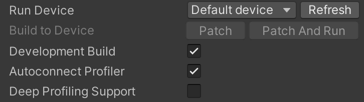
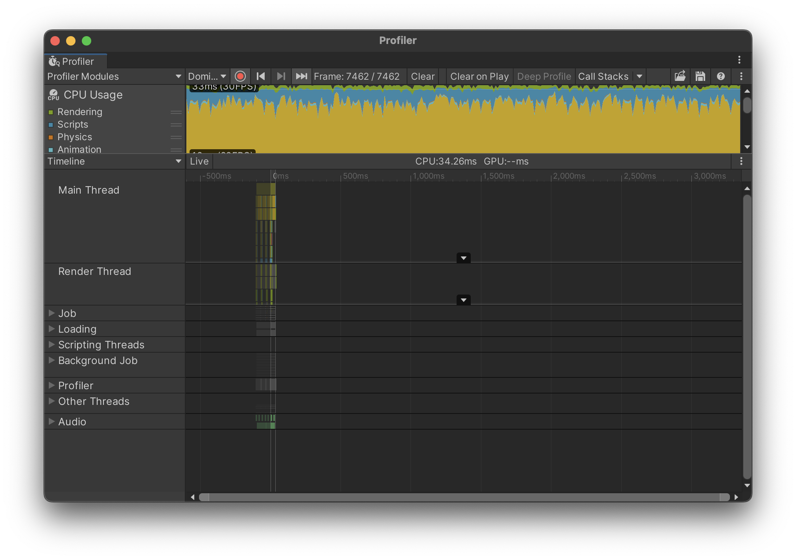
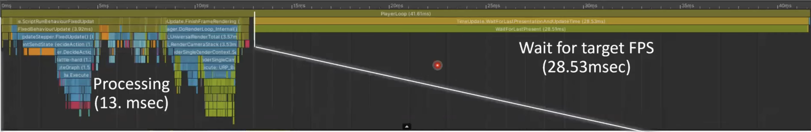
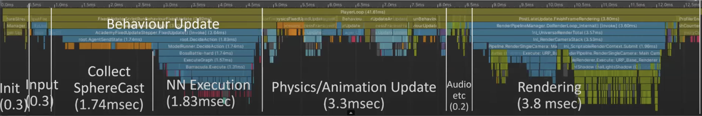

# Profiling
This time do a _Build and Run_, but with the following options ticked:

It may take some time, but after the game starts, switch back to the Unity Editor and you should see the Profiler dialog.

Let's zoom in and get an idea of what is going on.

Because we're running at 30 frames per second a large chunk of the frame is just waiting for the next frame. As it's done all the work it needs to do.

So if we zoom in on the bit where it's actually doing something useful...

Going from right to left, we see that a big chunk at the ends rendering as normal there's always a big chunk of rendering there's a big chunk of physics and animation update. But the behavior updates is the bit that we're really interested in. so the collect sphere cast here is taking about half the time, which is that Ray Perception that is casting all those rays and getting them back, so that we have the state of our environmen. 

Then in the neural network execution, you can see it is obviously playing the hard boss battle. Most of it is running the neural network and then there's a very thin sliver dedicated to getting the actions back out again, which will then move the characters and get them to to perform the appropriate actions.

The profiler only records about 300 frames by default. So looking back af Figure 1, the blue bits are scripts and that's our Behavior scripts running. There's also little Jagged teeth-like and that appears every five frames. It is every five frames because we've told it to run the neural network every fifth frame.

So using the Profiler you can see the performance and then you see whether something it taking too long and whether you need to address that issue.