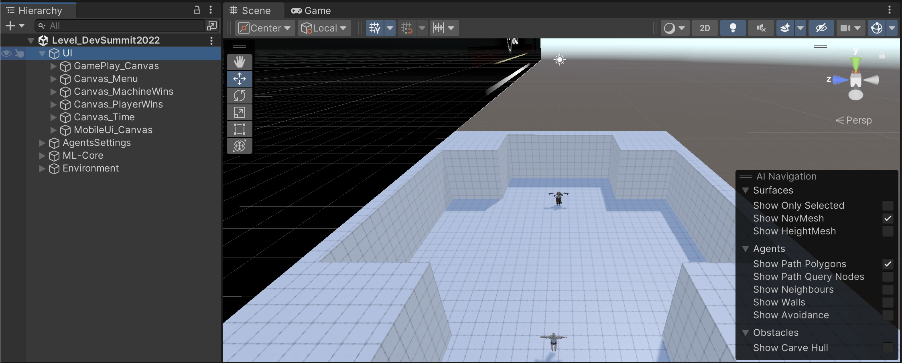
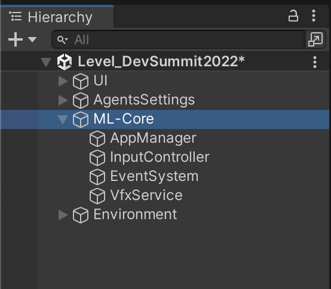

---
title: Scene Walkthrough
weight: 3

### FIXED, DO NOT MODIFY
layout: learningpathall
--- 

# Scene Walkthrough

## UI
A group of canvases for menus and onscreen controls:

## Environment
Includes the arena mesh and light:

## ML-Core
A group of machine language managers:

## Agents Settings
Will be our focus:

- Has a Battle Environment Controller script
- A Camera
- 2 characters ( Player and NPC, who will be fighting each other)
    * Both are setup with ML
    * Both have models and abilities (like fireball and to lock on target)

