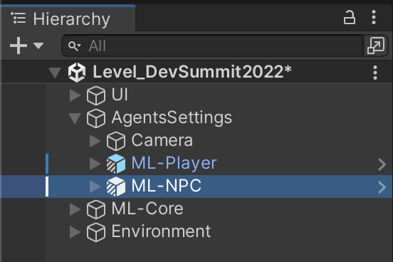
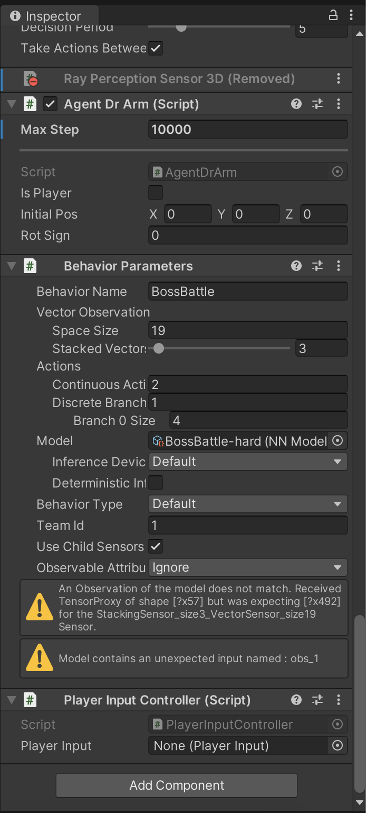
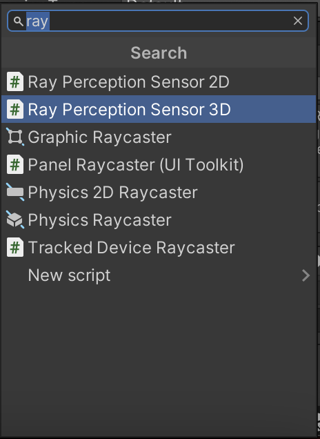
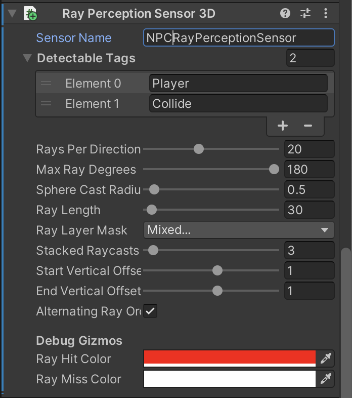
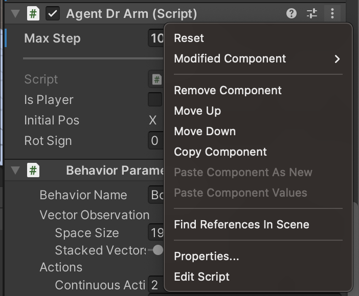
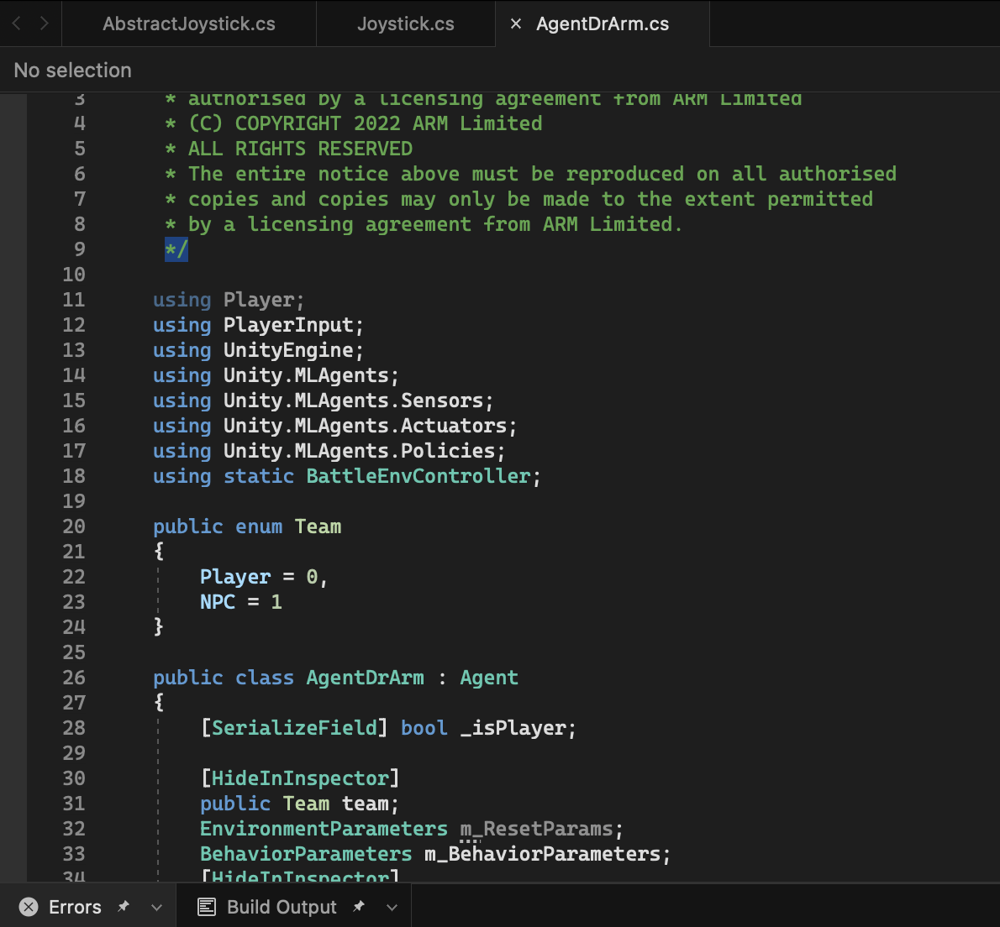
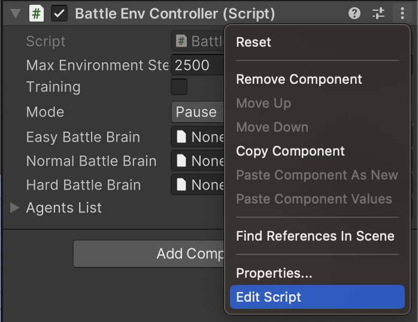
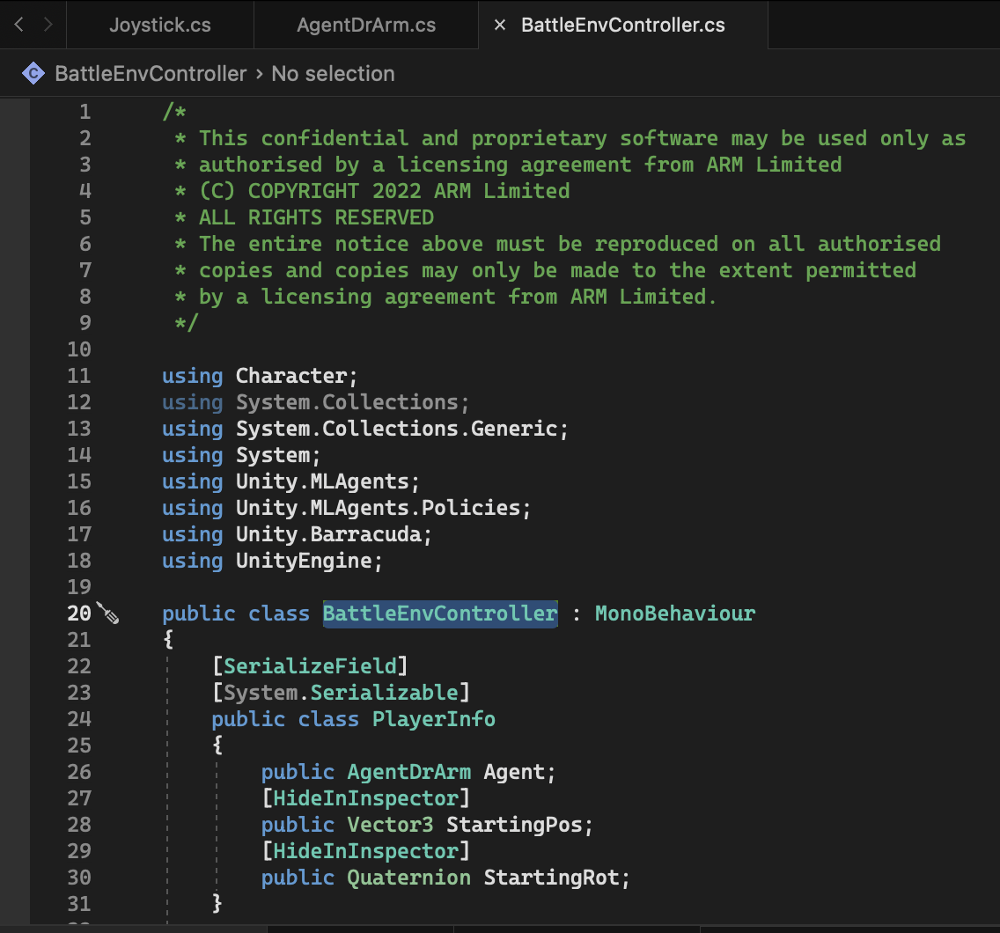

## Configure the NPC _Ray Perception Sensor 3D_ component
1. Select _ML-NPC_ by going to the _Level-DevSummit2022->AgentsSettings->ML-NPC_, as per Figure 1.

2. Next in the Inspector window (usually on the right) click the _Add Component_ button at the bottom, as per Figure 2. Notice the 2 warnings in the Inspector as below:

3. Now type _ray_ in the filter edit box, to narrow down the search. From the filtered list, double-click on _Ray Perception Sensor 3D_ to add this component to the ML-NPC object.

4. Notice that by adding the _Ray Perception Sensor 3D_ component, the _Model contains...._ warning message has now disappeared.

5. Now we need to change some properties to complete this component's set-up:
* Set the _Sensor Name_ property to "NPCRayPerceptionSensor"
* Add 2 _Detectable Tags_ elements and name them
    * "Player"
    * "Collide"
* Set _Rays Per Direction_ to "20"
* Set _Max Ray Degrees_ to "180"
* Set _Ray Length_ to "30"
* Set _Stacked Ray Traces_ to "3" (Notice how the _An Observation of the model..._ warning message has now disappeared)
* Set _Start Vertical Offset_ to "1"
* Set _End Vertical Offset_ to "1"
* The fully working component, with the correct properties updated, should look like this:

## Script Modifications
### Agent Dr Arm

1. With the ML-NPC still selected, in the Inspector, on the right, scroll until you see the _Agent Dr Arm (Script)_. To the right are 3 vertical dots. Click them to pop-up the context menu and select the _Edit Script_ option, at the bottom.

If you have Visual Studio installed, it will launch with the _AgentDrArm.cs_ file ready to be edited.

2. In the script, scroll down to the _CollectObservations()_ method. This method is key so that the reinforcment learning can make good decisions. 

3. Look for _// WORKSHOP TODO:_ and uncomment the lines of code for the player, and a bit further down for the NPC. Note all the observations that we are adding here so the agent has knowledge with which to make decisions.

4. Now scroll down to the _OnActionReceived()_ method. In reinforcement learning we need to know the state but we also need to get a reward - positive or negative. So we know whether out actions were successful or not, and our NPC can learn to do the right thing.

5. So again look for _// WORKSHOP TODO:_ in this method. Uncomment the line below it, which uses the _m_Existential_ value that is calculated in the _Initialize()_ function, to reward the NPC every frame that the ML is calculated. It's a small negative reward so that the agent is incentivised to try and win quickly. Further down we have the _Win()_ and _Lose()_ methods that give the big positive or negative rewards to each training episode.

### Battle Environment Controller
1. Now select the _AgentsSettings_ object, in the _Hierachy_ tab, on the left.

2. Then in the Inspector, scroll until you see the _Battle Environment Controller (Script)_. To the right are 3 vertical dots. Click them to pop-up the context menu and select the _Edit Script_ menu, at the bottom.

This should launch Visual Studio (if installed) with the _BattleEnvController.cs_ file ready to be viewed.

### Battle Environment Controller Script Walkthrough
Let's look at what various parts of this script do:

Go to Line _47_, where you'll see we have a _BattleMode_ enumeration class to keep track of the difficulty level we are fighting. 
We use this to determine which "brain" we want to use to make our decisions. We switch brains depending on how hard it is.

Go to the _Update()_ method at line _106_. This is being called each frame, but it's just begin, end and pause that we're detecting here. If the mode changes (line _108_) then we need to configure the agent and put the correct brain in.

Go to line _118_, to the _FixedUpdate()_ method and here we are largely checking for end conditions and if the battle over. 
So firstly if someone has died, as that's a good indicator that the battle's over, and then we give the appropriate win or loss reward depending on which one died. 
We give the reward around line _150_.  

If we're training the model (line _165_), then we we put out a nice message as well just so that we can keep track of what is going on.

Also if we're doing training (line _187_), we check if it's taking too long. You can take ages in the real battle, but during training we don't want them both just standing around forever. So after a certain amount of time we decide that they both lose. Then we can just start again and give them another chance to do better. 

Regardless of who lost, we reset the scene ready for the next set of training.

Go to the _ResetScene()_ method at line _244_. Here, when training (line _254_), we slightly vary the start position because we don't want to always start from exactly the same place. This is because we don't want to learn to attack from a specific position. We want to learn to attack the enemy from anywhere, so to avoid any weird start conditions, we shuffle the player and the enemy a little bit so they start from slightly different places.

Go to line _213_, to the _configureAgent()_ method, we enable the battle (line _215_) if we're not paused. We then check if it's the player and we're not in demo mode or training mode - if it's genuinely the player then we take the brain out, by setting it to null (line _219_), because the player is providing the action not the neural network. 

Otherwise we set the brain appropriately (from line _223_). So if we're in Easy Mode, we get the easy brain. If we're in hard mode, we have the hard brain, and then demo mode we've got the normal brain, and when we pause we take the brain out just to make sure that nothing odd is going on.

Then around line _277_ these are all the start conditions that get called from the game's menu, depending on whether you're starting a demo or the easy mode or the hard mode. 