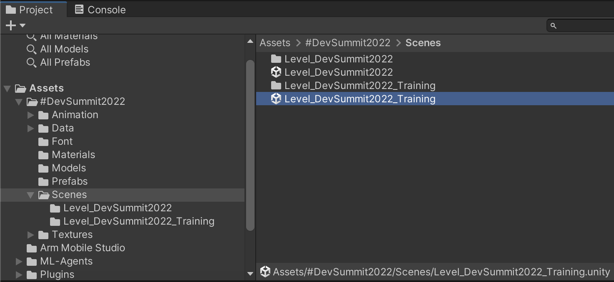
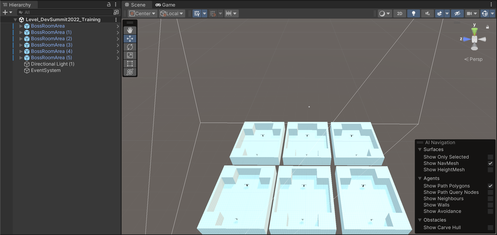
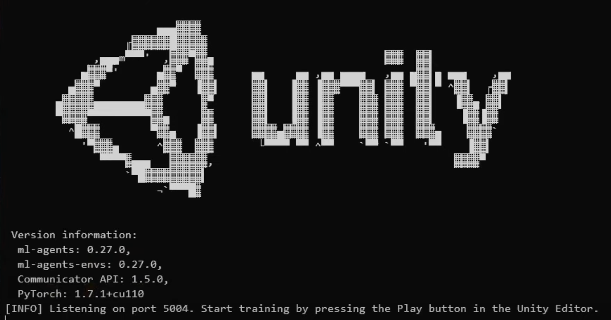
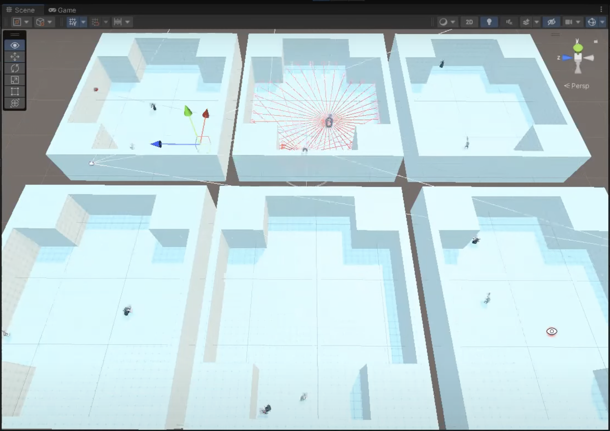
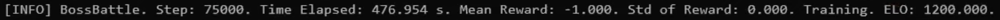
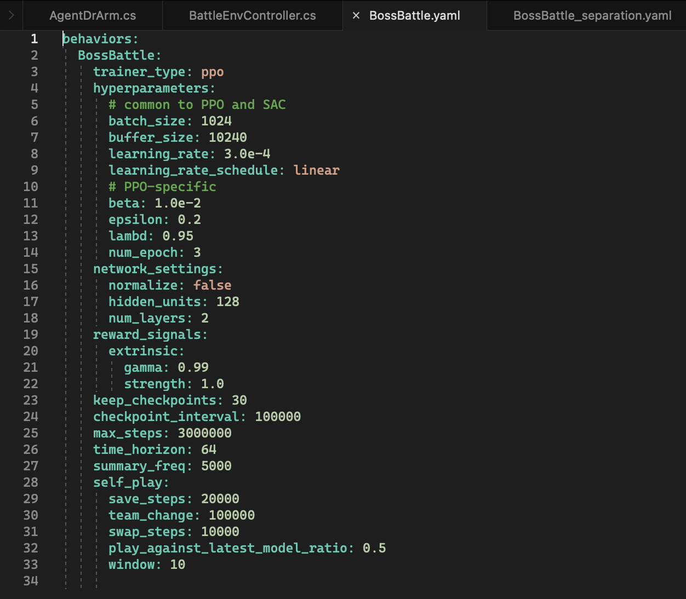
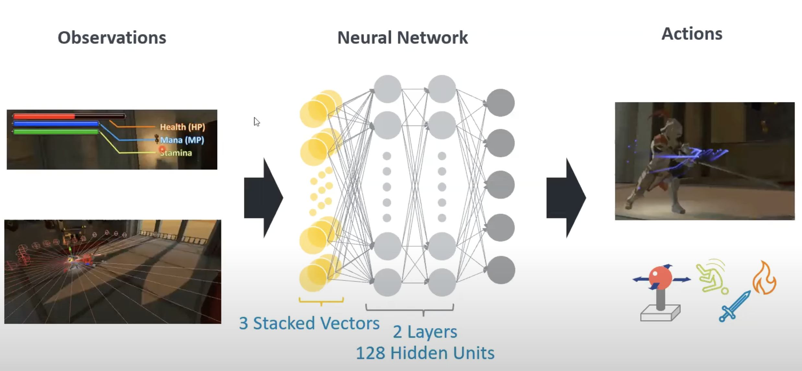
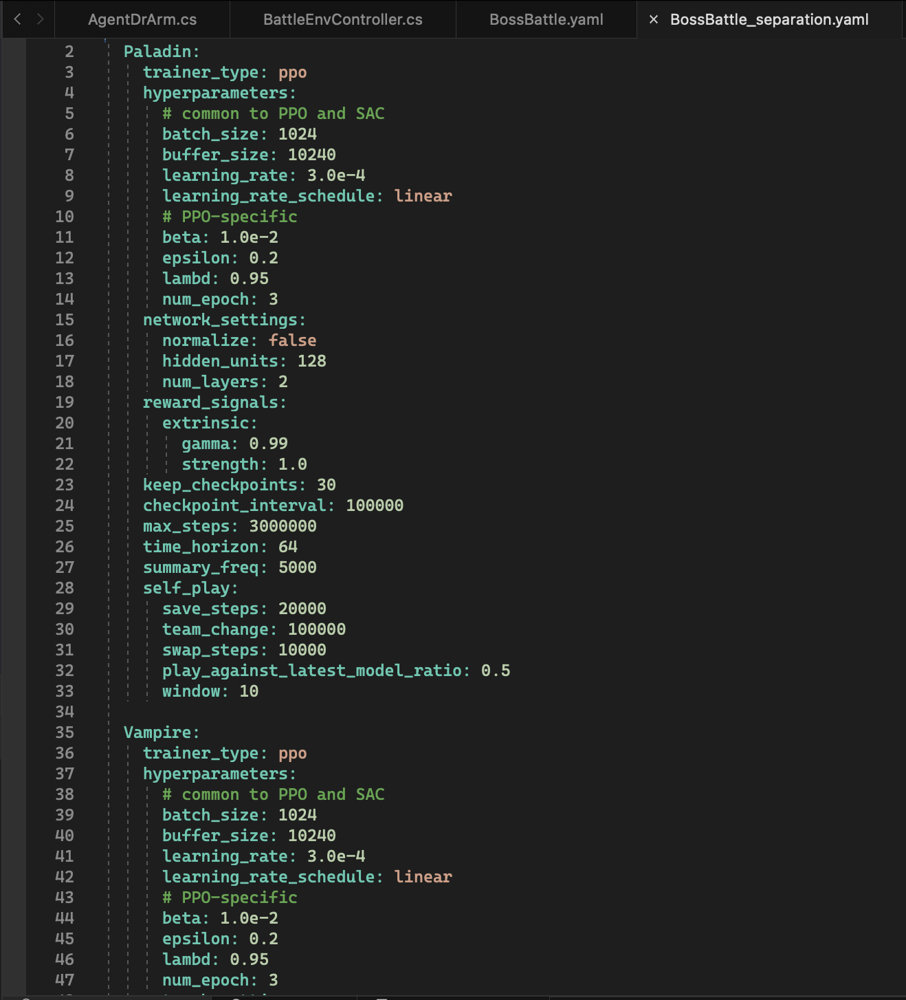
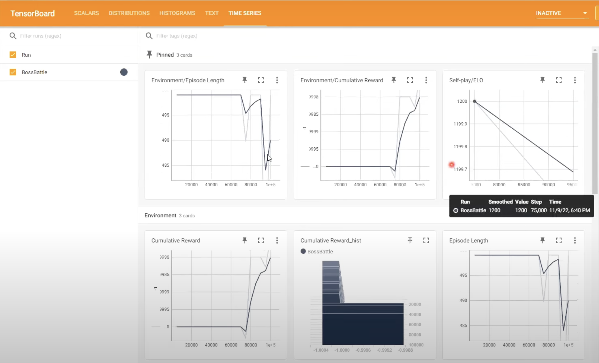

# Loading the Training Model Scene
Go to the _Project_ tab (bottom left) and navigate to Assets->#DevSummit2022->Scenes and this time double click the _Level_DevSummit2022_Training_ scene to open it.

Once loaded, it should look similar to this:

Notice there are 6 "arenas". You may have to adjust your view, in Unity, to be able to see all of them.

Six are used here to speed up the training. If you have more CPU power you could use more.

The other thing we are doing is that we speed it up massively. Normally there's quite a bit of frame time where it's just sitting waiting for the next frame. We don't need that for training or worry about that sort of thing. We want to go as fast as possible in the training and we want to get through hundreds of thousands of battles! So we speed that up.

Now when you do speed it up you have to be very careful. We had a bug were the fireball was going off in real-time  and everything else sped up on bullet time, racing around and the fireball would go slowly and the models didn't really care about the fireball because they were moving far too fast. So when you're doing the training, if you want to speed up time, which is a good idea, you just need to make sure it speeds up for everything or it will learn the wrong thing 😀.

The light has been removed as we only needed 1 light for the scene and also 1 event system was required. We also removed UI, as that isn't required for training. 

If you select _ML-Player_ you'll notice in the _Inspector_ that the _Is Player_ flag is no longer set, because in training it will not be controlled by a human player. Also in the _ML Player Manager_ we've set _Init on Start_ to true, as it does some extra initialisation. Then under _Agent Settings_ we have to make sure that the _Training_ property is set to true.

Take some time to look through each object in the arena, to see how it differs slightly, to the game scene.

We're now ready to kick off the training.

# Starting the Training
This section assumes you have read the pre-requisite document and installed _python_, _pytorch_ and _ml-agents_ correctly on your system.

1. Open up a console or terminal window and change directory so you are in the directory where you unzipped the project.
2. Assuming python etc is installed correctly you should be able to execture the command:
 
`.python-env/ml-agents/Scripts/activate`

which will then activate the python environment.
3. Once inside the python VM, you should be able to _cd Assets/Scripts/MlAgents/_, where all the required scripts are grouped.
4. Now you should be able to execute the command _mlagents-learn --torch-device cuda:0 ./config/BossBattle.yaml --run-id=testnew --force_
    * _--torch-device_ tell is which GPU to use for your training and  so _cuda:0_ is just the default GPU
    * _./config/BossBattle.yaml_ is the script that we will use for training
    * --run-id=testnew_ create a folder called "testnew" (use your own name, if you like) to store the results of our training
    * _--force_ is not strictly necessary, unless you are overriding a previous run of the same name
    * another option, not used here is _--resume_. This is useful for when you start your training and you either need to stop your computer, or you think you've done enough training, you when you stop the training it saves where it's up, like a checkpoint and the latest neural network, then you know decide that that's not enough training and want to resume, you can resume from there.
5. Once it starts, after a few seconds it will come up with a text Unity logo, that looks similar to this:

6. Notice at the bottom it tells you to _Start training by pressing the Play button in the Unity Editor_. So switch to the Unity Editor and do just that.
7. Once the Unity Editor starts and the learning begins it will usually switch to the _Game_ tab, which can be a little disorientating as the things are updating as fast as it can. Switch to the _Scene_ tab to be able to see all 6 agents going through the learning process. It should look similar to this:

8. If we switch back to our console/terminal window, every 5000 steps it will output the state of our learning, similar to this:

* _Boss Battle_ : The name of the behaviour within our script, that we are running.
* _Step_: How many steps/iteration have happened so far.
* _Time Elapsed_: How much time has elapsed since the training began.
* _Mean Reward_: The average of how many times we've rewarded loss or success. -1 means we're mostly losing. Usually after 100,000 steps is when the agents starts winning regularly.
* _ELO_: Means that someone actually won. ELO (named after Arpad Elo) is a method for calculating the relative skill levels of players in zero-sum games.

## The Training Scripts
Within Visual Studio open the _BossBattle.yaml_ and _BossBattle_separation.yaml_ files. You'll find both in the _Assets->Scripts->MlAgents->config_ subdirectory.
_BossBattle.yaml_ should looks like this:

This essentially give both the Player and the NPC the same brain, each with their own instance. 
These are the properties:
* _trainer type:ppo_ : PPO is an ML-Agent algorithm. The name stands for Proximal Policy Optimization. There are quite a number of different algorithms and if you go onto their GitHub you can learn about all the different ones they have. This one works very well for our scenario.
* _hyperparameters_ : Normal machine learning hypertype parameters
* _network settings_ : Sets up the actual size of the neural network. Notice it has _num layer: 2_ and _hidden units:128_ . In a more complex scenario you might have 3 layers and 256 hidden units. Refer to Figure 5 below for the MLP (multi-layer perceptron) explanation of the current setup.
    * The 1st layer is all of our observations, and we have 3 stacked vectors (for the last 3 frames), as input into the _neural network_.
    * Then in the _neural network_ we have 2 layers, each with 128 hidden units.
    * The NN outputs to _Actions_, which in this case map to the joysick movements and the ability to dodge roll, sword or fireball attack.

* On line 23 is the _keep checkpoint_ : which is how many time it should save a checkpoint.
* On line 24 is the _checkpoint interval_ : it's keeping the checkpoint every 100,000 battles, in this case.
* _max steps_ : Tells the learning to stop after 3,000,000 battles.
* _self play_ (line 28): is how often is switches between character that are using the same brian
    * _team change_: This value means it will change between characters every 100,000 battles.
    * _swap steps_: is the number of steps it should perform before creating a new brain for this character.

_BossBattle_separation.yaml_ should looks similar to this:

Within this yaml we have the ability to set-up 2 separate brains. One named _Paladin_ (for the knight) and another named _Vampire_ (for the NPC). Currently they have identical properties, but you could customise each to have slightly different behaviours.

Let's leave that running, as training to a competent level can take from 6 to 8 hours. So while that is running we take a look at Tensorboard.

# Tensorboard
In this section we look at what tensorboard provides us.

1. Open up a console or terminal window and change directory so you are in the directory where you unzipped the project, then going futher into the _Assets/Scripts/MlAgents/_ directory.
2. launch _tensorboard_ by executing the following command :

`tensorboard --logDir results/testnew --port 6006 --reload_multiple True`

3. This monitors our NN and gives us ratings of how our learning is progressing.
4. Now open up your browser to http://localhost:6006 (the port we passed to the launch command), which should look similar to this:

5. Some cards to take a note of:
    * _Episode Length_: Initially when no one is winning the episode length is maxiumum, until someone wins. Then the average slowly comes down. Once they start winning regularly it should come down a lot.
    * _Cumulative Reward_: Starts off being -1, becasue everyone is losing, but once everyone is starts winning it will go up rapidly and will eventually settle around zero, as that is where average will tend towards that over time.
    * _ELO_: As mentioned previously this is the score over time, as characters win, giving you an idea of how well your training is going.

