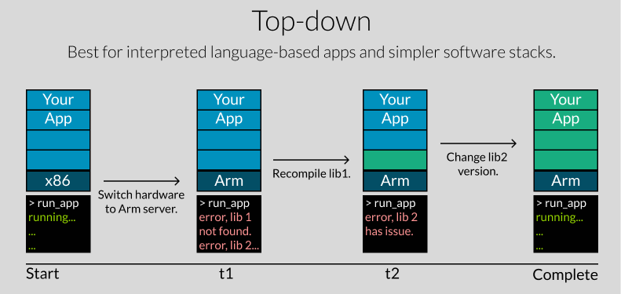
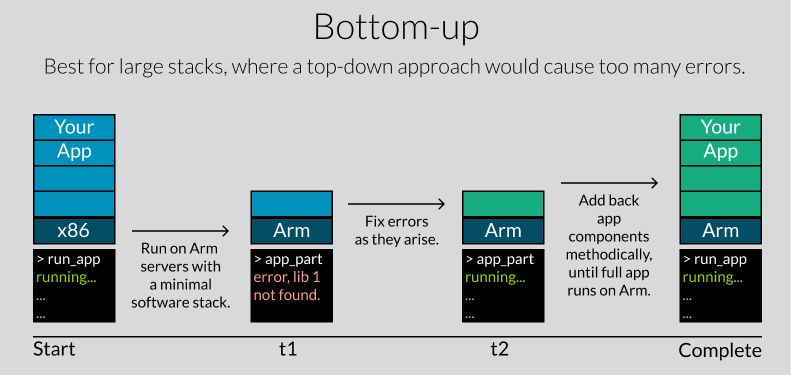

## STEP 1: Learn and explore

Arm Neoverse is a family of processor cores designed for servers and cloud data centers. There are 2 families of processors currently available, Neoverse V-series and Neoverse N-series.

### What is Arm Neoverse?

Neoverse V-series offers the highest overall performance, and Neoverse N-series offers industry-leading performance-per-watt and serves a broad set of server and cloud use cases. Each Neoverse CPU implements a version of the [Arm architecture](https://www.arm.com/architecture/cpu). Arm continually works with partners to advance the architecture and increase computing capability. Neoverse cores generally focus on high per-socket performance and do not rely on multithreading or extreme clock speeds to provide predictable performance. 

Below is a list of Neoverse CPUs, the architecture versions, and key benefits for that CPU.

| CPU         | Architecture version | Key features / benefits |
| ----------- | -------------------- | --------------------------------------------------------- |
| Neoverse N1 | Armv8.2-A            | SVE - Flexible vector processing for HPC and AI workloads |
| Neoverse V1 | Armv8.4-A            | SVE - Flexible vector processing for HPC and AI workloads |
| Neoverse V2 | Armv9.0-A            | SVE2 and security features such as MTE (Memory Tagging Extension) |
| Neoverse N2 | Armv9.0-A            | Excellent security with Arm CCA (Confidential Compute Archtecture). |

### What cloud hardware is availible today?

Click on each cloud service provider to see what Arm-based servers they offer with some helpful context.


  

The AWS Graviton server line offers instances as large as 64 vCPUs and 512 Gb of RAM in '16xlarge' formats. It also offers bare-metal instances (look for '.metal') for XYZ benefits. It offers compute for general-purpose workloads (M_g), memory-intensive workloads (R_g),  compute-intensive workloads (C_g).

| Generation    | Arm CPU      | Abbreviation   | Comments                                                                    |
|---------------|--------------|----------------|-----------------------------------------------------------------------------|
| **Graviton**  | Cortex-A72   | A1             | First public Arm-based server.                                              |
| **Graviton2** | Neoverse-N1  | C6g, M6g, R6g  | 600% performance and efficiency increases.                                  |
| **Graviton3** | Neoverse-V1  | C7g, M7g, R7g  | 25% performance increase, DDR5 memory added, 50% more memory bandwidth      |
| **Graviton4** | Neoverse-V2  | R8g            | 75% more memory bandwidth, up to 40% faster for databases and 30% faster for web applications.   |

  
  
The Microsoft Azure server line offers instances as large as 64 vCPUs and 208 Gb of RAM in the 'D64ps_v5' format. It does not offer bare-metal instances. It offers compute for general-purpose workloads (Dps), memory-optimized workloads (Eps),  compute-intensive workloads (Fsv), and high-performance (Cobalt).

| Generation    | Arm CPU      | Variations         | Comments  |  
| --------------|--------------|--------------------|-----------|
| **psv5**      | Neoverse-N1  | Dpsv5, Epsv5       | First pass |
| **psv6**      | Neoverse-N2  | Dpsv6, Epsv6, Fsv6 | Offering improved performance over v5. |
| **Cobalt**    | Neoverse-N2  | Cobalt 100         | 40% improved performance over v6 generation. |

  
   
The Google GCP server line offers instances as large as 80 vCPUs and 640 Gb of RAM in the 'c3a-highmem' format. It does not offer bare-metal instances. It offers compute for general-purpose workloads (standard) and memory-optimized workloads (highmem).

| Generation    | Arm CPU      | Variations         | Comments  |  
| --------------|--------------|--------------------|-----------|
| **T2A**         | Neoverse-N1 | T2A-standard | Optimized for general-purpose workloads - web servers, and microservices. |
| **C3A**         | Custom (AmpereOne)   | c3a-standard, c3a-highmem | Compute-optimized - large-scale databases, media transcoding, and HPC. |
| **Axion (C4A)** | Neoverse-V2 | c4a-standard, c4a-highmem          | General-purpose and AI/ML workloads. |

  
   
The Oracle OCI server line offers instances as large as 160 vCPUs and 1024 Gb of RAM in the 'BM.Standard.A1' format. It offers bare-metal instances (look for 'BM' as opposed to 'VM'). It offers compute for general-purpose workloads (?), memory-optimized workloads (?),  compute-intensive workloads (?).

| Generation    | Arm CPU      | Variations         | Comments  |  
| --------------|--------------|--------------------|-----------|
| **A1**    | Neoverse-N1          | VM.Standard.A1  | Offers predefined (.#CPUs) or dynamic OCPU and memory allocation (.Flex) |
| **A2**    | Custom (AmpereOne)   | VM.Standard.A2, VM.Optimized3.A2 | This generation is tailored for high-performance and memory-intensive workloads. |

  

   

| Generation    | Arm CPU      | Variations         | Comments  |  
| --------------|--------------|--------------------|-----------|
| **Grace Hopper**  | Neoverse-V2          | ?  | Delivers excellent ML performance. |

  



Read [Get started with Servers and Cloud Computing](https://learn.arm.com/learning-paths/servers-and-cloud-computing/intro) to learn more where you can find Arm hardware in the cloud.

## STEP 2: Plan your transition

Newer software is  generally easier to migrate because Arm support continues to improve and  performance optimizations are typically better in newer versions of  software. Interpreted languages and Jit compilers, such as Python, Java, PHP, and Node.js are easiest to migrate. Compiled languages such as C/C++, Go, and Rust are slightly more difficult because they need to be recompiled. The most difficult situations involve a language, runtime, operating  system, or something else which is not available on Arm and would be  difficult to run on Arm.

Make notes about operating  system versions, programming languages, development tools, container  tools, performance analysis tools, deployment tools, and any other  important scripts included in the project. Start with the [Migrating applications to Arm servers](https://learn.arm.com/learning-paths/servers-and-cloud-computing/migration/) Learning Path to start your migration journey. It explains how to set  up a development machine, some migration challenges, and other tips for  different programming languages.

### Survey your software
Depending on your situation, you may want to try the migration using a bottom-up approach or a top-down approach. The below graphic explains their differences and  advantages.

 

 

### Research dependencies

Look through your scripts and Makefiles to see if you spot architecture specific files. 

Migration typically falls into 3 categories:
1. The Linux package manager installs software from the main repositories without any changes, totally seamless.
2. Software installed using scripts or binary downloads requires minor changes to strings, such as changing “x86_64” and “amd64” to “arm64” or “aarch64”.
3. A few software projects still don't support Arm Linux, some are well known projects like the Edge browser, and the others are smaller projects that haven't added Arm support, yet. Some could be blockers and others may be easy to compile yourself.

The [Software Ecosystem Dashboard for Arm](https://www.arm.com/developer-hub/ecosystem-dashboard/) is a resource to identify if your software dependencies are available for Arm. 

Use the Ecosystem Dashboard to find software and understand if everything you need runs on Arm. If you don't find software listed, please raise an issue in the [GitHub project](https://github.com/ArmDeveloperEcosystem/ecosystem-dashboard-for-arm/) or submit a pull request. 

### Migration helpers

If you face specific issues with porting software you can try [Porting Advisor for Graviton](https://learn.arm.com/install-guides/porting-advisor/), a source code analysis tool which identifies incompatibilities.

If your code uses intrinsics from another architecture, you can use the libraries covered in [Porting architecture specific intrinsics](https://learn.arm.com/learning-paths/cross-platform/intrinsics/)

There are additional resources which may help you find answers to your migration questions:

- [All Arm Learning Paths for Servers and Cloud](https://learn.arm.com/learning-paths/servers-and-cloud-computing/) 
    - [AWS Learning Paths](https://learn.arm.com/learning-paths/servers-and-cloud-computing/?cloud-service-providers-filter=aws/#)
    - [Google Cloud Learning Paths](https://learn.arm.com/learning-paths/servers-and-cloud-computing/?cloud-service-providers-filter=google-cloud/#)
    - [Microsoft Azure Learning Paths](https://learn.arm.com/learning-paths/servers-and-cloud-computing/?cloud-service-providers-filter=microsoft-azure/#)
    - [Oracle Learning Paths](https://learn.arm.com/learning-paths/servers-and-cloud-computing/?cloud-service-providers-filter=oracle/#)
- [Infrastructure Solutions blog](https://community.arm.com/arm-community-blogs/b/infrastructure-solutions-blog/)
- [Arm software install guides](https://learn.arm.com/install-guides)
- [AWS Graviton Technical Guide](https://github.com/aws/aws-graviton-getting-started) contains a wealth of information. 

Additional migration resources:
 - [Programming Languages](/migration/languages/)
 - [Optimized Libraries](/migration/libraries/)
 - [Containers](/migration/containers/)
 - [Databases](/migration/databases/)
 - [Web applications](/migration/web/)
 - [Networking](/migration/networking/)

## Build and run

Based on your initial research, decide how to proceed with trying your software on Arm. 

Use the resources above to build and run your application on Arm. 

Make sure to watch for any test tools or saved test results so you can plan for them on Arm. 

## STEP 3: Test and Optimize

### Measure performance

Once the application is running you can measure performance. This can be as simple as timing an application or may involve using performance analysis tools 

Additional performance analysis and benchmarking resources:
- [Learn the Arm Neoverse N1 performance analysis methodology](https://learn.arm.com/learning-paths/servers-and-cloud-computing/top-down-n1/)
- [Profiling for Neoverse with Streamline CLI Tools](https://learn.arm.com/learning-paths/servers-and-cloud-computing/profiling-for-neoverse/)
- [Learn how to optimize an application with BOLT](https://learn.arm.com/learning-paths/servers-and-cloud-computing/bolt/)
- [How to use the Arm Performance Monitoring Unit and System Counter](https://learn.arm.com/learning-paths/servers-and-cloud-computing/arm_pmu/)
- [NVIDIA Grace CPU Benchmarking Guide](https://nvidia.github.io/grace-cpu-benchmarking-guide/index.html)
- [Learn about Large System Extensions (LSE)](https://learn.arm.com/learning-paths/servers-and-cloud-computing/lse/)

Your goal is to understand if the performance you see will translate into the expected price performance advantages. If you are unsure or need additional help you can submit an issue on GitHub. 

### Deploy

Once the price performance gains are confirmed, you can plan for a larger deployment. 

This may involve a variety of steps:
- Experimenting with different virtual machine sizes or instance types to find the best fit for your application
- Adding some Arm notes to your Kubernetes cluster and running a subset of workloads on Arm
- Directing some of your web traffic to an Arm version of the application 
- Creating a complete version of your application in a dev environment for additional testing

Make sure to research the details needed for these tasks by checking any places you use infrastructure as code or other places you store details about virtual machine types and sizes, as well as parameters for managed services.

You can also check [Works on Arm](https://www.arm.com/markets/computing-infrastructure/works-on-arm) for the latest cloud and CI/CD initiatives for developers.

## Summary

The 3 step process combined with the available resources help you migrate applications to Arm.

